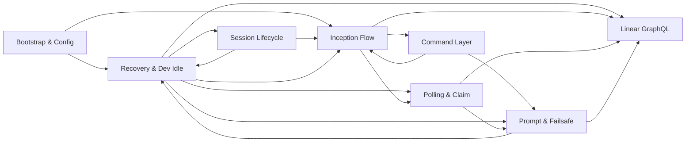

# Forge Architecture

> Generated from the GitNexus knowledge graph: 77 files, 798 symbols, 28 execution flows, 8 functional areas.

## Overview

Forge is an opencode plugin that orchestrates 7 AI agents through a lean
software delivery pipeline. It uses Linear as its state spine — stories move
through workflow states, and the plugin polls, claims, and dispatches them to
the right agent at the right time.

The plugin runs in two modes:

1. **Inception** — 8 sequential phases that take a project from idea to
   iteration-ready (lean canvas → event storm → stories → UX → tech stack →
   architecture → iteration map).
2. **Development** — polls Linear for stories in `ready-for-dev`,
   `ready-for-qa`, and `ready-for-acceptance` states, creates opencode
   sessions, and dispatches the appropriate agent.

The plugin is dormant by default. `/forge new project` activates inception
mode; after Phase 8 completes, the plugin transitions to development mode.
`/forge stop` deactivates everything.

## System Diagram

```mermaid
graph TB
    subgraph Entry["Entry Points"]
        CMD["Slash Commands<br/>/forge new project, stop, status, approve"]
        IDLE["session.idle hook"]
        ERR["session.error hook"]
        COMPACT["session.compacting hook"]
        BOOT["Plugin startup"]
    end

    subgraph Core["Plugin Core (src/plugin.ts)"]
        FP["ForgePlugin<br/>entry point, config load, hook registration"]
        HSI["handleSessionIdle<br/>routes idle events by mode"]
        HII["handleInceptionIdle<br/>inception phase transitions"]
        HDI["handleDevIdle<br/>development story dispatch"]
        HF["handleFailsafe<br/>auto-advance or halt"]
        HC["handleCompaction<br/>loop state injection"]
        ROS["recoverOrphanedSessions<br/>crash recovery on startup"]
        SP["startPolling<br/>Linear poll loop"]
        PAC["pollAndCreate<br/>claim story → create session"]
        CSFS["createSessionForStory<br/>build prompt → session.create"]
        FAS["findActiveSession<br/>dedup active sessions"]
        PST["parseSessionTitle<br/>extract storyId + agent from title"]
    end

    subgraph Linear["Linear Client (src/linear-client.ts)"]
        PS["pollStories<br/>fetch ready stories"]
        USS["updateStoryState<br/>transition state"]
        GSS["getStoryState<br/>read current state"]
        GLC["getLastComment<br/>read handoff comment"]
        GLCD["getLastCommentWithDate<br/>timestamped comment"]
        PC["postComment<br/>write handoff comment"]
        EWS["ensureWorkflowStates<br/>create 14 Forge states"]
        HFS["hasForgeStates<br/>check team readiness"]
        IFT["isFreshTeam<br/>detect unconfigured team"]
        GQL["graphql<br/>HTTP transport"]
    end

    subgraph Prompts["Prompt Builder (src/prompt-builder.ts)"]
        BP["buildPrompt<br/>story + handoff + commit protocol"]
        BIP["buildInceptionPrompt<br/>phase-specific inception prompt"]
        BLP["buildLoopPrompt<br/>autonomous recovery prompt"]
        RLM["readLoopMd<br/>read skill loop state file"]
    end

    subgraph Config["Config (src/config.ts)"]
        LC["loadConfig<br/>read forge.yaml"]
        NC["normalizeConfig<br/>defaults + validation"]
        VC["validateConfig<br/>required fields check"]
        SC["saveConfig<br/>write forge.yaml"]
    end

    subgraph Persist["Persistence"]
        SESSIONS[".forge/sessions.json"]
        PROJECT[".forge/project-state.json"]
    end

    subgraph External["External"]
        LINEAR["Linear API<br/>GraphQL"]
        OCODE["opencode SDK<br/>session.create, promptAsync, showToast"]
        AGENTS["7 Agent Definitions<br/>po, architect, dev, qa, etc."]
        SKILLS["24 Skills<br/>SKILL.md + LOOP.md"]
    end

    %% Entry → Core
    CMD --> FP
    IDLE --> HSI
    ERR --> HSI
    COMPACT --> HC
    BOOT --> FP

    %% Core internal routing
    FP --> LC
    HSI --> HII
    HSI --> HDI
    HII --> SP
    SP --> PAC
    PAC --> CSFS
    PAC --> FAS
    HDI --> HF
    HF --> CSFS
    ROS --> CSFS
    CSFS --> BP

    %% Core → Linear
    PAC --> PS
    CSFS --> USS
    HF --> GLC
    HF --> USS
    ROS --> GSS

    %% Core → Prompts
    HII --> BIP
    HDI --> BLP
    BP --> RLM

    %% Core → Persistence
    CSFS --> SESSIONS
    HII --> PROJECT
    ROS --> SESSIONS

    %% Linear internal
    PS --> GQL
    USS --> GQL
    GSS --> GQL
    GLC --> GQL
    EWS --> GQL

    %% Config internal
    LC --> NC
    NC --> VC

    %% Core → Config
    FP --> NC
    CMD --> SC

    %% Linear → External
    GQL --> LINEAR

    %% Core → External
    CSFS --> OCODE
    BP --> AGENTS
    BP --> SKILLS
    BIP --> SKILLS
    BLP --> SKILLS
    CMD --> OCODE
```



## Functional Areas

The knowledge graph detected 8 functional areas (communities) via the Leiden
algorithm. Each has a distinct responsibility:

| Area | Symbols | Cohesion | Responsibility |
|------|---------|----------|---------------|
| **Plugin Bootstrap & Config** | 7 | 86% | Plugin entry point, config loading/validation, session/project state persistence |
| **Command Layer** | 6 | 77% | Slash command handlers (`/forge new project`, `stop`, `status`, `approve`) |
| **Linear GraphQL Transport** | 8 | 69% | Low-level Linear API: graphql(), workflow state CRUD, comment read/write |
| **Polling & Story Claim** | 3 | — | Story polling, active session dedup, `pollAndCreate` orchestration |
| **Recovery & Dev Idle** | 9 | 72% | Crash recovery, dev idle handling, session error handling, session persistence, `parseSessionTitle` |
| **Inception Flow** | 8 | 69% | Inception phase management, new project kickoff, fresh team detection, project state save |
| **Prompt & Failsafe** | 6 | 60% | Prompt building (story/inception/loop), `readLoopMd`, failsafe auto-advance |
| **Session Lifecycle** | 6 | 77% | `session.idle`/`session.error` hooks, `handleCompaction`, `isForgeSession`/`isInceptionSession` guards |

### Inter-Area Connections



Key observations:
- **Session Lifecycle (C7)** is the event hub — `session.idle` routes to both
  inception (C5) and dev/recovery (C4) based on plugin mode.
- **Linear GraphQL (C2)** is the data layer — 6 of 8 areas call into it.
- **Prompt & Failsafe (C6)** is called by both inception and dev flows to
  build agent prompts with handoff context.
- **Recovery & Dev Idle (C4)** has the most outgoing edges (4) — it handles
  crash recovery, dev-mode dispatch, session errors, and failsafe.

## Key Execution Flows

The knowledge graph traced 28 execution flows. The 8 most architecturally
significant are documented below.

### 1. Inception Idle → Linear API (6 steps)

Triggered when an inception session goes idle. Checks if the current phase's
artifact exists; if so, advances to the next phase. After Phase 8, transitions
from inception mode to development mode and starts polling Linear.

```
session.idle → handleSessionIdle → handleInceptionIdle
  → startPolling → pollAndCreate → createSessionForStory
  → updateStoryState → graphql
```

### 2. Inception Idle → Loop State Read (6 steps)

Same trigger as above, but the flow through prompt building — reads the
relevant `LOOP.md` skill file to construct the next agent's prompt with
autonomous recovery instructions.

```
handleInceptionIdle → startPolling → pollAndCreate
  → createSessionForStory → buildPrompt → readLoopMd
```

### 3. Session Idle → Active Session Search (6 steps)

The core routing path. Every `session.idle` event enters `handleSessionIdle`,
which checks `isForgeSession` / `isInceptionSession`, then routes to either
`handleInceptionIdle` or `handleDevIdle`.

```
session.idle → handleSessionIdle → handleInceptionIdle
  → startPolling → pollAndCreate → findActiveSession
```

### 4. Dev Idle → Linear API (5 steps)

Triggered when a development-mode session goes idle. Calls `handleFailsafe`
to check for a recent handoff comment. If found, auto-advances the story to
the next Linear state and creates a new session for the next agent.

```
handleDevIdle → handleFailsafe → createSessionForStory
  → updateStoryState → graphql
```

### 5. Failsafe → Linear API (4 steps)

The failsafe mechanism. When a dev session goes idle but the agent forgot
to advance the story state, the plugin reads the last comment. If it's a
handoff comment (within 2 minutes), the plugin auto-advances the story.
If no comment exists, the story is halted as `halted-ambiguous`.

```
handleFailsafe → createSessionForStory → getLastComment → graphql
```

### 6. Slash Command → Linear API (5 steps)

Triggered by `/forge new project`. Checks if the Linear team already has
Forge workflow states; if not, creates all 14 states. Then transitions to
inception mode and starts Phase 1.

```
tui.command.execute → startNewProject → hasForgeStates
  → getWorkflowStates → graphql
```

### 7. Crash Recovery → Linear API (3 steps)

On plugin startup, `recoverOrphanedSessions` runs. It reads `.forge/sessions.json`,
lists all opencode sessions, and for each Forge session that no longer exists
in opencode, checks the story's Linear state to determine if it should be
re-claimed or marked as done.

```
ForgePlugin → recoverOrphanedSessions → getStoryState → graphql
```

### 8. Compaction → Loop Injection (3 steps)

When `experimental.session.compacting` fires, `handleCompaction` checks if
the session is a Forge session. If it's an inception session, it injects the
current loop state into the compaction context to preserve phase progress
across context window resets.

```
experimental.session.compacting → handleCompaction → isInceptionSession
```

## File Layout

```
forge/
├── src/
│   ├── plugin.ts          # Plugin entry + all hooks + session management (~900 lines)
│   ├── linear-client.ts   # Linear GraphQL client: poll, claim, comment, workflow states (~350 lines)
│   ├── prompt-builder.ts  # Agent prompt construction: story + inception + loop prompts (~225 lines)
│   ├── config.ts          # forge.yaml load/validate/save (142 lines)
│   └── types.ts           # TypeScript types: ForgeConfig, Story, AgentRole, ForgeSessionInfo (~150 lines)
├── bin/
│   └── forge.ts           # CLI: `forge init` (installs plugin + agents + skills + commands)
├── agents/                # 7 agent definitions with per-role skill permissions
├── skills/                # 24 skills (SKILL.md + LOOP.md each)
├── .opencode/commands/forge/  # 4 slash commands (new-project, stop, status, approve)
├── integrations/           # External tool installers (graphify, headroom, browser-use, ui-ux-pro-max)
├── tests/                  # 87 tests across 4 files (198 expect calls)
└── docs/                   # Loop state file templates (inception.loop.md, iteration-board.loop.md)
```

## Design Decisions

### 1. Plugin over Daemon

The coordinator is an opencode plugin, not a separate PM daemon. This
eliminates a process boundary, avoids IPC, and gives the plugin direct access
to the opencode SDK (`client.session.create`, `client.session.promptAsync`,
`client.tui.showToast`). The trade-off: the plugin only runs while opencode
is running.

### 2. Linear as State Spine

All story state lives in Linear. The plugin polls Linear's GraphQL API on an
interval, claims stories by transitioning their workflow state, and posts
handoff comments that the next agent reads. This makes the state visible to
humans in the Linear UI and eliminates the need for a separate database.

### 3. session.idle as the Event Bus

opencode fires `session.idle` when an agent completes its work. The plugin
uses this as the primary event to drive state transitions: idle in inception
mode → check artifact → advance phase; idle in dev mode → check failsafe →
advance story state → create next agent session.

### 4. Failsafe Auto-Advance

When a dev-mode session goes idle, the plugin reads the last comment on the
story. If it was posted within 2 minutes (indicating a handoff), the plugin
auto-advances the story to the next workflow state and creates a session for
the next agent. If no recent comment exists, the story is halted as
`halted-ambiguous` to prevent silent drift.

### 5. Crash Recovery on Startup

On plugin initialization, `recoverOrphanedSessions` checks
`.forge/sessions.json` for sessions that no longer exist in opencode (crashed
or closed). For each orphaned session, it reads the story's current Linear
state and either re-claims it (creates a new session for the appropriate
agent) or marks it as done if Linear already shows completion.

### 6. Coordinator Owns Pull→Active, Agents Own Active→Next-Pull

The plugin (coordinator) is responsible for the `pull → active` transition —
it polls Linear, claims a story, and creates a session. The agents are
responsible for the `active → next-pull` transition — they post a handoff
comment and the next `session.idle` triggers the failsafe to advance the
story. This separation prevents race conditions where the coordinator and
agent both try to transition state simultaneously.

### 7. Commit per AC Before Desk Check

After each acceptance criterion turns GREEN, the developer agent must
`git commit` and `git push` with the format
`feat({STORY-ID}): AC{n} — {summary}` before proceeding to desk check. The
Guardian skill verifies this commit exists via `git log`. This ensures
working code is always in the repo before a story moves to QA.

### 8. 8-Phase Inception with session.idle Transitions

Inception has 8 sequential phases. The plugin doesn't time them — instead it
hooks `session.idle`. When an inception session goes idle, it checks if the
expected artifact for the current phase exists (e.g., `CONTEXT.md` for Phase
2, `lean-canvas.md` for Phase 3). If the artifact exists, the phase advances
and the next agent session is created with a phase-specific prompt. This
makes inception self-pacing: slow phases get more time, fast phases move
quickly.
