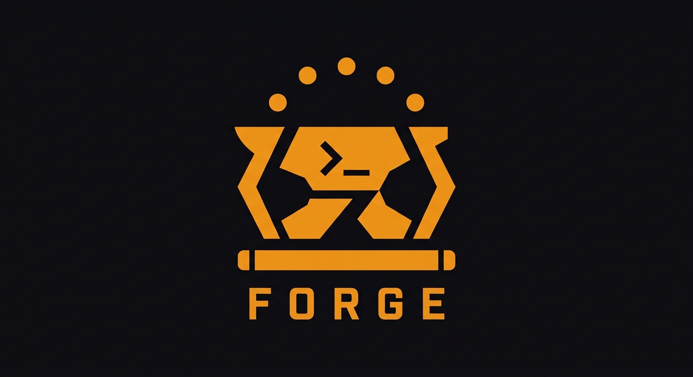

# Forge

<p align="center">
  
</p>

[](https://github.com/loopworx/forge/actions/workflows/pipeline.yml)
[](https://www.npmjs.com/package/@loopworx/forge)
[](LICENSE)
[](https://oxc.rs)
[](https://github.com/loopworx/loopkit)

**Forge** is an opencode plugin that orchestrates 7 AI agents through a lean software delivery pipeline — from inception to production. It uses Linear as the state spine and runs fully within opencode.

---

## Why Forge — Removing AI Slop

Forge is an attempt to create the perfect product team — a team of agents with
enforced roles, gated handoffs, and a feedback loop where every piece of work
is verifiable, gated, and recoverable. Seven agents — PO, UX, Architect,
Developer, QA, DevOps, SecOps — each own a defined slice of the delivery
pipeline and are blocked from operating outside it.

The outer acceptance test goes RED before any implementation code is written;
TDD inner loops drive each sub-slice green (FE then BE); a QA desk check
inspects every acceptance criterion through the UI exactly as a customer would;
a scoped regression suite guards adjacent flows; and PO acceptance verifies
shipped behavior against the original story intent. State lives in Linear —
visible and human-readable — never in plan files or conversation summaries,
which "lie." Loop pre-flights, failsafe auto-advance, crash recovery, and
commit-per-AC guarantee nothing is silently lost. An L1-RIGID skill hierarchy
overrides "just this once," and [loopkit](https://github.com/loopworx/loopkit)
— a static analyzer that validates all 24 skill contracts on every push —
keeps the process itself from drifting into slop.

> The full mechanism map — 20 anti-slop claims, each tied to the skill that
> enforces it — lives in [docs/anti-slop.md](docs/anti-slop.md).

---

## How It Works

1. **Install** — `forge init` drops the plugin, 7 agent definitions, 24 skills, slash commands, and handles Linear authentication
2. **Start** — `/forge new project` kicks off the 8-phase inception flow
3. **Deliver** — after inception, the plugin polls Linear for stories, claims them, creates agent sessions, and coordinates the delivery pipeline

There is no separate process or daemon. The plugin activates when you run `/forge new project` and stops with `/forge.stop`.

### Plugin Modes

| Mode | Behavior |
|------|----------|
| **Dormant** | Default. Plugin is registered but idle — no polling, no sessions. |
| **Inception** | 8-phase discovery: lean canvas → empathy map → trade-off sliders → event storming → UX design → story writing → tech stack → iteration map |
| **Development** | Polls Linear every N seconds for stories in pull states. Claims stories, creates agent sessions, handles handoffs and crash recovery. |

### The Seven Agents

| Agent | Owns |
|---|---|
| **po-agent** | Inception, story writing, backlog, story acceptance |
| **ux-agent** | Empathy mapping, UX specs, design system |
| **architect-agent** | Architecture Decision Records, service boundaries, tech debt |
| **developer-agent** | ATDD loops, TDD inner loops, contract tests, feature flags |
| **qa-agent** | Acceptance test authoring, desk checks, regression suite |
| **devops-agent** | CI/CD, environments, Unleash feature flags, deployments |
| **secops-agent** | Threat modeling, security ACs, SAST/DAST pipeline gates |

Each agent loads its assigned skills at session start. Roles are enforced by skill design — the developer agent doesn't make architecture decisions, and the architect agent doesn't write production code.

---

## Installation

```bash
# Install globally
bun add -g @loopworx/forge
# or: npm install -g @loopworx/forge

# Initialize in your project (handles everything — auth included)
cd my-project
forge init

# Start the inception flow (run this inside opencode)
/forge new project
```

`forge init` is a single zero-config command: it installs all files, registers the Linear MCP server, and authenticates via OAuth (opens your browser). The plugin auto-discovers your Linear team from the OAuth session — no API keys, no team keys, no manual steps.

### What `forge init` installs

| Path | Contents |
|------|----------|
| `.opencode/plugins/forge.js` | The Forge plugin (coordinator) |
| `.opencode/agents/` | 7 agent definitions with skill permissions |
| `.opencode/skills/` | 24 skills (SKILL.md + LOOP.md each) |
| `.opencode/commands/forge/` | Slash commands: `new-project`, `stop`, `status`, `approve` |
| `forge.yaml` | Plugin config — poll interval, concurrency, inception phases (no auth config needed) |
| `opencode.json` | Linear MCP server config + plugin registration |

---

## Delivery Pipeline

Stories flow through Linear workflow states:

```
in-analysis → ready-for-dev → in-dev → ready-for-qa → in-qa
  → ready-for-acceptance → in-acceptance → ready-to-deploy → done
```

- **Stories are pulled, not assigned** — the plugin polls for stories in pull states, claims them (pull → active), and creates agent sessions
- **Handoff comments** — agents post compact summaries to Linear via MCP; the next agent reads them as context
- **Failsafe** — if an agent forgets to update Linear state but posted a handoff comment, the plugin auto-advances; if no comment, it halts as `halted-ambiguous`
- **Crash recovery** — on startup, the plugin checks `.forge/sessions.json` for orphaned sessions and re-claims active ones
- **Commit per AC** — after each acceptance criterion goes green, the developer agent commits with `feat({STORY-ID}): AC{n} — {summary}` before desk check

### Delivery Lifecycle

1. **Inception** (8 phases) — PO, UX, and Architect agents facilitate structured discovery
2. **Story Refinement** — Four-gate review: PO drafts → UX value gate → developer feasibility → QA testability
3. **Iteration Zero** — CI/CD, environments, test harness scaffold, feature flags
4. **ATDD Loops** — Outer Acceptance Test RED → sub-slice TDD (FE + BE) → GREEN → desk check
5. **Kanban Flow** — Stories move through the Linear state machine independently
6. **Feature Flags + Trunk-Based CD** — Everything on trunk; unfinished stories behind flags

---

## Skills Library (24 skills)

**Meta**
- `using-forge` — precedence rules, agent roles, session start protocol
- `resuming-sessions` — query Linear + read CONTEXT.md before anything else

**Discovery** (8-phase inception)
- `facilitating-inception`, `facilitating-event-storming`, `establishing-ubiquitous-language`, `designing-ux`, `writing-stories`, `building-iteration-map`

**Architecture**
- `selecting-tech-stack`, `establishing-architecture`, `deciding-architecture`

**Iteration Zero**
- `bootstrapping-project`, `validating-test-harness`

**Development (L1 Rigid)**
- `running-atdd-sessions`, `running-tdd-loops`, `managing-feature-flags`

**Quality & Acceptance**
- `running-desk-checks`, `writing-acceptance-tests`, `running-regression-suite`
- `approving-stories`, `finishing-stories`

**Security**
- `modeling-threats`, `securing-pipeline`, `guarding-loops`

All 24 skills are verified on every push by [loopkit](https://github.com/loopworx/loopkit) — a static analyzer for agent skill contracts. It validates state transitions, enforced states, handoff references, desk check patterns, bug feedback loops, progressive disclosure, naming conventions, and terminology across every SKILL.md and LOOP.md file.

```bash
# Run locally
cargo install loopkit
loopkit .
# 24 skills checked. 0 error(s), 0 warning(s). 205 verification(s) ran.
```

The pipeline uses the [loopworx/loopkit](https://github.com/loopworx/loopkit) GitHub Action for CI verification.

---

## Development

```bash
# Clone
git clone https://github.com/loopworx/forge
cd forge
bun install

# Checks
bun run lint       # oxlint — 0 warnings, 0 errors
bun run typecheck  # tsc --noEmit
bun test           # 92 tests, 242 expect calls
bun run build      # compile plugin → dist/plugin.js

# Test forge init locally
mkdir /tmp/forge-test && cd /tmp/forge-test
bun run /path/to/forge/bin/forge.ts init
```

### Pipeline

Every push to main runs a single sequential pipeline:

```
build → (typecheck ‖ lint ‖ loopkit) → test → release
```

The release job auto-increments the npm version, publishes, creates a git tag, and generates a GitHub Release with commit history as release notes.

---

## Contributing

1. Fork the repository
2. Create a feature branch
3. Ensure `bun run lint && bun run typecheck && bun test && bun run build` pass
4. Submit a PR

---

## License

MIT — see [LICENSE](LICENSE).
