# Forge Graph Engine — Implementation Playbook

**Audience:** a fresh implementing agent (any harness) that has **only this repo + this file**. It is self-contained. Read `docs/graph-engine.md` for the architecture rationale ("why"); this file is the executable "how".

**One-line goal:** Replace Forge's hardcoded 14-state linear state machine with a generic, DOT-driven graph engine (workflows in `.forge` files) that activates agent nodes through the existing pi.dev runtime, verifies each node's outcome, and owns all control flow — while skills demote to pure domain expertise. Direct cutover, no back-compat aliases.

**Status when you start:** `src/engine/graph/dot-types.ts` already exists (the parsed-DOT type model). Everything else in this plan is unbuilt. The repo is on branch `graph-engine`, clean, at `main` with no external consumers — a clean cutover is safe and intended.

---

## 0. How to use this document

- Work **phase by phase, strictly test-first** (§2). Each phase (§5) lists: goal, dependencies, files to create (test first), files to modify/delete, acceptance tests, and the **green gate** you must pass before committing.
- Build to the **data shapes in §3** — they are the contract the executor/verifiers/TUI all share.
- The four `.forge` workflow sources in §3.11 are authoritative; the parser/validator/loader must accept exactly those.
- **Never** invent a new runtime dependency. The DOT parser is hand-written. `yaml` is config-only.
- When you finish a phase, commit (§2 commit format), then push. Open one draft PR for the whole branch at the end (or update an existing one).
- If you discover a gap between this plan and the code, trust the **code + §3 data shapes**, and update this file in the same commit.

---

## 1. Repo orientation

- **Stack:** TypeScript 5.9, Bun runtime, `bun:test`, oxlint, `tsc --noEmit`, `typebox`, `yaml`. Bun is the runtime AND test runner.
- **Package:** `@loopworx/forge`. Entry: `bin/forge.ts` → built to `dist/forge.js`.
- **Quality-gate commands (run from repo root):**
  - `bun test` — all tests.
  - `bun run typecheck` — `tsc --noEmit`.
  - `bun run lint` — `oxlint src/ tests/` (must be 0 warnings / 0 errors).
  - `bun run build` — bun build of `bin/forge.ts` (must succeed).
- **Baseline:** On a clean checkout, run `bun test` once and record the exact `pass`/`expect` counts (the prior plan cited ~217 tests / ~591 expects). **That number is your non-regression floor for every phase.** Do not let it drop.
- **Test pattern:** `bun:test` with `describe/it/expect`. Engine tests use a `Mock*` harness — in `tests/engine/workflow-engine.test.ts` there are `MockStoryRepository`, `MockArtifactRepository`, `MockSessionManager`, `MockSession`, `MockProofValidator`, `MockPromptBuilder`, `MockConfig`, `MockRuntime` implementing the `src/engine/interfaces.ts` seams. **Reuse this pattern** for all new engine/graph/verifier/tool tests: implement the seam interfaces with fakes, no real Linear/git/network.
- **Source layout (relevant):**
  - `src/engine/` — `state-machine.ts`, `workflow-engine.ts`, `claim-queue.ts`, `git-proof-validator.ts`, `interfaces.ts`, `types.ts`, `events.ts`, `session-manager.ts` (engine-side tracker), `file-persistence.ts`, `memory-persistence.ts`, clocks.
  - `src/engine/graph/` — NEW graph engine lives here (`dot-types.ts` already present).
  - `src/engine/verifiers/` — NEW verifiers live here.
  - `src/agent/` — `session-manager.ts` (pi.dev `AgentSessionManager` — the node-activation seam, **reused unchanged**), `tool-registry.ts`, `event-adapter.ts` (`adaptSdkEvent`), `command-registry.ts`, `model-fetcher.ts`.
  - `src/agent/tools/` — NEW Forge tool families live here.
  - `src/prompts/prompt-builder.ts` — legacy prompt builder (deleted in Phase 2; replaced by `src/engine/graph/node-prompt.ts`).
  - `src/config/config-loader.ts` + `templates/forge.yaml` — config.
  - `templates/agents/*.md`, `templates/skills/*/SKILL.md` + `LOOP.md`, `templates/forge.yaml`.
  - `tests/engine/state-machine.test.ts`, `tests/templates/templates-completeness.test.ts` — will be rewritten/extended.
- **Config seam:** `ForgeConfig` (in `src/engine/types.ts`) is loaded by `config-loader.ts` from `templates/forge.yaml`. You will add `workflow.graphFile` (absent ⇒ `templates/workflows/pipeline.forge`).

---

## 2. Conventions & guardrails

- **Strict TDD, no exceptions:** write the failing test → run `bun test <file>` and confirm it fails for the right reason → implement the minimum to pass → confirm green → commit. No implementation code before its test.
- **Each phase ends green:** `bun run lint` && `bun run typecheck` && `bun test` && `bun run build` all pass before you move on. The non-regression floor (§1) must hold.
- **No new runtime deps.** Hand-write the DOT parser. `yaml` is for `forge.yaml` only; graphs are DOT.
- **Direct cutover, no aliases:** when a graph equivalent lands, delete the legacy thing in the *same* phase — do not keep a shim. (See §4 for the per-phase deletion map.)
- **Deny-by-default tools:** an `agent` node with no `tools` attribute gets zero external tools (unless `interactive=true`). The validator flags it.
- **`context` is required on every `agent` node.** No implicit context.
- **Determinism by default:** all built-in verifiers are deterministic (exit codes, git-log grep, artifact presence, human yes/no). No LLM-as-judge. ATDD edges are fully deterministic.
- **pi.dev is the agent runtime — do not reinvent it.** `agent` nodes activate via the existing `AgentSessionManager.createSession`/`resolveModel`/`ModelRegistry`/`createAgentSession` and the `agent_settled` event. Mock the `SessionConfig` seam in tests.
- **JSON-serializable observable surface:** engine events and `GraphExecution` state are plain JSON (no functions/classes in payloads) so a future Rust/ratatui TUI can consume them.
- **Naming:** keep `halted-*` halt vocabulary and `forge_*` tool prefix; new node-completion tools use `forge_node_*`. Graph files use `.forge`.
- **Commit format:** conventional-commits subject + body, ending with a blank line and:
  ```
  Co-Authored-By: Oz <oz-agent@warp.dev>
  ```
  One logical commit per TDD step (or per cohesive sub-step); each commit green.

---

## 3. The spec — data shapes you build to

### 3.1 DOT grammar subset + Forge extensions (the parser's contract)

The parser is **topology + identity + raw string attributes**. It does **not** parse the *inner* structure of Forge composite values (`verifier="all-of(...)"`, `budget="{...}"`, `context="[a, b]"`, `class_defaults="..."`, `tools="[...]"`) — those stay opaque strings, resolved downstream by the validator/class-resolver/graph-template. This keeps the parser small and the composable values diffable.

**Supported grammar (EBNF-ish):**
```
graph        := "digraph" ID? "{" stmt* "}"
stmt         := attrStmt | nodeStmt | edgeStmt | subgraphStmt | (";" | newline)
attrStmt     := ("graph" | "node" | "edge") attrList
subgraphStmt := "subgraph" ID? "{" stmt* "}"            // cluster_* groups
nodeStmt     := ID attrList?
edgeStmt     := idList edgeOp idList attrList?          // edgeOp = "->", chains: a -> b -> c
idList       := ID (ID)*                                 // multiple tails/heads allowed
attrList     := "[" attr ("," | ";")* attr? "]"
attr         := ID ("=" value)?
value        := quotedString | bareToken
quotedString := '"' (escape | nonQuote)* '"'
bareToken    := /[A-Za-z0-9_.:\-+#]+/                    // incl. hyphens (human-gate), dots, '@' for @prompt
```
- **Comments:** `//...`, `#...`, `/* ... */`.
- **Edge op:** `->` only (digraph).
- **Quoted strings:** support escapes `\"`, `\\`, `\n`, `\t`. A quoted value may contain `,`, `:`, `{`, `}`, `[`, `]`, spaces, `—` (em dash).
- **Bare tokens:** identifiers, numbers, hyphenated/dotted identifiers (`human-gate`, `Mdiamond`, `glm-5.2`), `@path/to/file.md` (`@` allowed as first char).
- **IDs:** bare or quoted. Reserved: `digraph`, `subgraph`, `graph`, `node`, `edge` (these start attr/subgraph statements, not node IDs).
- **What the parser must NOT do:** no HTML labels, no ports (`node:port`), no `strict`, no `graph`/`digraph` mutual distinction beyond accepting `digraph`. Reject nothing structurally beyond syntax — topology validation is the validator's job.

**Output:** a `Digraph` (see `dot-types.ts`). Flatten subgraph-scoped `node`/`edge` defaults onto contained nodes/edges at parse time (a node inside `subgraph cluster_dev { node [class="coding"] ... }` inherits `class="coding"` unless it overrides). Keep `DotSubgraph` structure for rendering/context-pooling.

### 3.2 Node kinds + shape derivation (already in `dot-types.ts`)

`kind` is primary; `shape` is derived for rendering. `shape=` is accepted as an alias (import). `kindFromAttrs(attrs)` resolves: `kind` attr → else `shape` attr mapped via `SHAPE_TO_KIND` → else default `agent` (DOT default shape `box`).

| kind | was (shape) | execution behavior |
|---|---|---|
| `agent` | box | multi-turn LLM with tools, via pi.dev |
| `prompt` | tab | one-shot prompt, no tools |
| `command` | parallelogram | shell `script` or named `verifier` |
| `human-gate` | hexagon | pause for approval |
| `conditional` | diamond | route on `condition` |
| `fan-out` | component | parallel split |
| `fan-in` | tripleoctagon | parallel join |
| `wait` | insulator | pause |
| `subworkflow` | house | nested digraph (expand) |
| `start` | Mdiamond | terminal |
| `exit` | Msquare | terminal |

### 3.3 Attribute catalog

**Graph attrs** (`graph [...]`): `goal`, `class_defaults` (opaque CSS-ish string, §3.4), `max_node_visits` (int), `default_fidelity`, `rankdir`.

**Node attrs** (Fabro retained): `label`, `prompt` (`@path` ref), `class`, `model`, `provider`, `reasoning_effort`, `fidelity`, `thread_id`, `timeout`, `max_visits` (int), `max_retries`, `retry_policy`, `retry_target`, `goal_gate` (bool), `selection`. **Forge extensions:** `agent_role`, `linear_state`, `verifier` (named or composite string), `budget` (object string), `halt_kind`, `expand_from`, `expand_key`, `context` (namespace-list string), `tools` (allowlist string), `interactive` (bool), `workflow` (subworkflow file ref).

**Edge attrs:** `label` (may include `[A]`/`[R]` accelerators), `condition`, `weight` (int), `freeform`, `context_updates` (opaque string).

Booleans: `true`/`false` (bare) — also accept `goal_gate` written bare as `true`. Ints: parse `max_visits`, `weight`, `max_node_visits` as numbers on the typed accessor (keep raw string in attrs, expose parsed via helper).

### 3.4 `class_defaults` format + specificity

Header string, e.g.:
```
class_defaults="coding: {model: deepseek-v4-pro, reasoning_effort: high}, review: {reasoning_effort: high}, gate: {model: glm-5.2}"
```
`class-resolver.ts` parses this into `Record<className, {model?, provider?, reasoning_effort?, fidelity?}>` and resolves each node's effective model config with specificity **`#id > .class > kind > *`**:
1. per-node `model`/`provider`/`reasoning_effort` (highest);
2. the node's `class` entry from `class_defaults`;
3. (kind-level defaults — optional, usually none);
4. nothing (undefined ⇒ pi.dev `resolveModel` falls back to its own config via `agent_role`).

No external CSS, no `model_stylesheet`, no `models.css`.

### 3.5 Context namespaces + assembly

`context="[story, ac]"` selects namespaces. Standard namespaces:
- `story` — id, title, acceptance criteria, feature flag.
- `project` — CONTEXT.md, constraints, design-system ref.
- `ac` — current AC + its sub-slices.
- `slice` — current sub-slice.
- `iteration` — current iteration.
- `interactive` — human dialogue + artifact-in-progress (inception).

`node-context.ts` assembles **exactly** the declared namespaces into a minimal preamble. **Edges carry `context_updates`** (from `forge_node_complete` return) that mutate downstream context. For `subworkflow` nodes, `context` selects the **pool** propagated to the inner graph; the expanded item's namespace (from `expand_key`, e.g. `ac`/`slice`) is added to the pool; inner `agent` nodes declare their own (narrower) `context` from the pool. Agents pull more on demand via `context-tools`.

### 3.6 `VerifierResult` + Verifier registry

```ts
type Verdict = "pass" | "fail" | "retry" | "escalate";
interface VerifierResult { verdict: Verdict; reasons: string[]; }
interface Verifier {
  readonly name: string;
  verify(ctx: VerifierContext): VerifierResult | Promise<VerifierResult>;
}
```
Built-in verifiers (all deterministic): `git-commit` (grep git log for AC pattern via `forge_git_log`), `test-red` (`forge_run_tests`, expect non-zero exit), `test-green` (`forge_run_tests`, expect zero exit), `lint-clean` (`forge_run_lint`, expect zero exit), `artifact` (`forge_read_artifact` presence), `acceptance-criteria` (read engine checkpoint state, no external call), `human-approval` (`forge_request_approval` + pause). Composites: `all-of(...)` / `any-of(...)` engine-side combinators. `verifier` attr string is parsed by a small parser into a name or composite tree.

A `script` on a `command` node is the anonymous inline verifier (pass if exit 0).

### 3.7 `GraphExecution` / `NodeStatus` / checkpoint

```ts
type NodeStatus = "pending" | "running" | "verifying" | "passed" | "failed" | "halted" | "escalated";
interface NodeState { nodeId: string; status: NodeStatus; visits: number; lastVerifier?: VerifierResult; }
interface GraphExecution {
  executionId: string;            // story id OR inception id
  graphVersion: GraphVersion;     // pinned
  nodes: Record<string, NodeState>;
  subExecutions: Record<string, GraphExecution>; // nested subworkflow state
  edgeCrossings: EdgeCrossing[];  // append-only log
  context: Record<string, unknown>;
  startedAt: number; updatedAt: number;
}
```
Persisted to `.forge/executions/{executionId}.json`, **atomic per checkpoint** (every status change + every edge crossing). Resume reconstructs and continues at the last `pending`/`verifying` node (incl. mid-subworkflow).

### 3.8 Condition expression grammar (Phase 4)

Edge `condition` is a deterministic predicate. Support:
- Literals: `outcome=succeeded`, `outcome=failed`.
- Context refs: `context.KEY`, `context.ac_index`, `context.tests_passed`.
- Operators: `&&`, `||`, `!`, `=`, `!=`, `>`, `<`, `>=`, `<=`, `contains`, `matches`.
- Truthiness for bare booleans.
Tiebreak multiple matching out-edges by `weight` (lower = higher priority; default 0). Agent JSON routing directives (`preferred_next_label`/`suggested_next_ids`/`context_updates`) are an opt-in alternative to `condition`, instrumented via events.

### 3.9 `expand_from` / `expand_key` (Phase 3)

For `subworkflow` nodes: `expand_from` names a per-execution list path (e.g. `story.acceptanceCriteria`, `ac.subSlices`); `expand_key` is the per-item context key (e.g. `ac`, `slice`). At activation, `graph-template.ts` reads the list from execution context and instantiates one inner-graph run per item, setting `context.<expand_key>` and advancing `context.<key>_index`/`<key>_total` for the `next_ac` gate. **Nested expansion** is supported (an expanded AC subworkflow itself expands per sub-slice). No model-decided routing inside expansion — it is data-driven and deterministic.

### 3.10 Commit message template (ATDD `commit` node)

Deterministic format; the agent never decides it:
```
feat({story.id}): AC{ac.index} — {ac.summary}
```
The agent supplies only `{ac.summary}` content via `forge_node_complete` → `context_updates`, and only when warranted. The `commit` `command` node runs `git add -A && git commit -m '<rendered template>'`.

### 3.11 The four `.forge` workflows (authoritative sources)

Place under `templates/workflows/`. These exact sources must parse + validate.

**`templates/workflows/pipeline.forge`** (the default graph):
```dot
digraph ForgePipeline {
  graph [goal="Deliver a verified story", rankdir=LR,
    class_defaults="coding: {model: deepseek-v4-pro, reasoning_effort: high}, review: {reasoning_effort: high}, gate: {model: glm-5.2}"]
  start [kind=start]; exit [kind=exit]
  dev    [label="Dev (ATDD)", kind=subworkflow, workflow="atdd.forge", agent_role="developer-agent",
          class="coding", goal_gate=true, linear_state="in-dev",
          expand_from="story.acceptanceCriteria", expand_key="ac", context="[story, ac]",
          verifier="all-of(git-commit, acceptance-criteria)", budget="{maxAttempts:3}"]
  desk   [kind=human-gate, label="Desk Check (QA)", agent_role="qa-agent", linear_state="in-deskcheck", class="review", context="[story, ac]"]
  qa     [label="Regression", kind=command, agent_role="qa-agent",
          linear_state="in-qa", verifier="test-green", goal_gate=true]
  accept [kind=human-gate, label="PO Acceptance", agent_role="po-agent", linear_state="in-acceptance", context="[story]"]
  gate   [kind=human-gate, label="Deploy Gate (DevOps)", agent_role="devops-agent", linear_state="ready-to-deploy", class="gate", context="[story]"]
  start -> dev -> desk
  desk -> qa      [label="[A] Approve"]
  desk -> dev     [label="[R] Fix"]
  qa -> accept    [condition="outcome=succeeded"]
  qa -> dev       [label="Fix"]
  accept -> gate  [label="[A] Accept"]
  accept -> dev   [label="[R] Reject"]
  gate -> exit    [label="[A] Deploy"]
}
```

**`templates/workflows/atdd.forge`**:

```dot
digraph ATDD {
  graph [goal="Drive all ACs green: outer AT RED, then per sub-slice FE+BE red-green-refactor, commit per AC", rankdir=LR]
  start [kind=start]; exit [kind=exit]
  subgraph cluster_dev { node [thread_id="dev", agent_role="developer-agent", class="coding", context="[story, ac]"]
    write_at      [label="Write outer AT (RED)", kind=agent, prompt="@skills/running-atdd-sessions.md", context="[story, ac]", max_visits=3, linear_state="in-dev"]
    verify_at_red [label="AT is RED?", kind=command, verifier="test-red", goal_gate=true]
    at_red_gate   [kind=conditional, label="RED confirmed?"]
    slices        [label="Sub-slices", kind=subworkflow, workflow="tdd-slice.forge",
                   expand_from="ac.subSlices", expand_key="slice", context="[slice]"]
    commit        [label="Commit AC", kind=command, script="git add -A && git commit -m 'feat({story.id}): AC{ac.index} — {ac.summary}'"]
    verify_ac     [label="AC green?", kind=command, verifier="all-of(git-commit, test-green)", goal_gate=true]
    ac_gate       [kind=conditional, label="AC green?"]
    write_at -> verify_at_red -> at_red_gate
    at_red_gate -> slices   [label="RED", condition="outcome=succeeded"]
    at_red_gate -> write_at  [label="Not RED"]
    slices -> commit -> verify_ac -> ac_gate
    ac_gate -> next_ac [label="Pass", condition="outcome=succeeded"]
    ac_gate -> write_at [label="Fix"]
  }
  next_ac [kind=conditional, label="All ACs done?"]
  next_ac -> exit     [condition="context.ac_index >= context.ac_total"]
  next_ac -> write_at [label="Next AC"]
}
```


**`templates/workflows/tdd-slice.forge`**:

```dot
digraph TDDSlice {
  graph [goal="One sub-slice: FE red-green-refactor then BE red-green-refactor", rankdir=LR]
  start [kind=start]; exit [kind=exit]
  write_fe_test   [label="Write FE test (RED)",  kind=agent, prompt="@skills/running-tdd-loops.md", context="[slice]"]
  verify_fe_red   [label="FE RED?",  kind=command, verifier="test-red",  goal_gate=true]
  write_fe_impl   [label="FE impl (GREEN)", kind=agent, prompt="@skills/running-tdd-loops.md", context="[slice]"]
  verify_fe_green [label="FE GREEN?", kind=command, verifier="test-green", goal_gate=true]
  refactor_fe     [label="Refactor FE (minimize + best practices)", kind=agent, prompt="@skills/running-tdd-loops.md", context="[slice]"]
  verify_fe_ref   [label="FE green + lint?", kind=command, verifier="all-of(test-green, lint-clean)", goal_gate=true]
  write_be_test   [label="Write BE CDC test (RED)",  kind=agent, prompt="@skills/running-tdd-loops.md", context="[slice]"]
  verify_be_red   [label="BE RED?",  kind=command, verifier="test-red",  goal_gate=true]
  write_be_impl   [label="BE impl (GREEN)", kind=agent, prompt="@skills/running-tdd-loops.md", context="[slice]"]
  verify_be_green [label="BE GREEN?", kind=command, verifier="test-green", goal_gate=true]
  refactor_be     [label="Refactor BE (minimize + best practices)", kind=agent, prompt="@skills/running-tdd-loops.md", context="[slice]"]
  verify_be_ref   [label="BE green + lint?", kind=command, verifier="all-of(test-green, lint-clean)", goal_gate=true]
  start -> write_fe_test -> verify_fe_red -> write_fe_impl -> verify_fe_green -> refactor_fe -> verify_fe_ref
       -> write_be_test -> verify_be_red -> write_be_impl -> verify_be_green -> refactor_be -> verify_be_ref -> exit
  verify_fe_red -> write_fe_test [label="Not RED"]
  verify_fe_green -> write_fe_impl [label="Not GREEN"]
  verify_fe_ref -> refactor_fe [label="Not GREEN"]
  verify_be_red -> write_be_test [label="Not RED"]
  verify_be_green -> write_be_impl [label="Not GREEN"]
  verify_be_ref -> refactor_be [label="Not GREEN"]
}
```


**`templates/workflows/inception.forge`**:
```dot
digraph Inception {
  graph [goal="Discover and frame the product via 8 phases", rankdir=LR,
    class_defaults="discovery: {model: glm-5.2, reasoning_effort: high}"]
  start [kind=start]; exit [kind=exit]
  p1 [label="Lean Canvas", kind=agent, class="discovery", interactive=true, context="[interactive]", prompt="@skills/facilitating-inception.md"]
  p2 [label="Empathy Map", kind=agent, interactive=true, context="[interactive]", prompt="@skills/designing-ux.md"]
  p3 [label="Trade-off Sliders", kind=agent, context="[interactive]"]
  p4 [label="Event Storming", kind=agent, interactive=true, context="[interactive]", prompt="@skills/facilitating-event-storming.md"]
  p5 [label="UX/UI Design", kind=agent, interactive=true, context="[interactive]", prompt="@skills/designing-ux.md"]
  p6 [label="Story Writing", kind=agent, interactive=true, context="[interactive]", tools="[forge_create_artifact]", prompt="@skills/writing-stories.md"]
  p7 [label="Tech Stack + ADR", kind=agent, interactive=true, context="[interactive]", prompt="@skills/selecting-tech-stack.md"]
  p8 [label="Iteration Map", kind=agent, context="[interactive]", tools="[forge_create_artifact]"]
  g1 [kind=human-gate,label="Phase 1 ok?"]; g2 [kind=human-gate,label="Phase 2 ok?"]
  g6 [kind=human-gate,label="Stories ok?"]; g7 [kind=human-gate,label="ADR ok?"]
  start -> p1 -> g1 -> p2 -> g2 -> p3 -> p4 -> p5 -> p6 -> g6 -> p7 -> g7 -> p8 -> exit
  g1 -> p1 [label="[R] Revise"]; g2 -> p2 [label="[R] Revise"]
  g6 -> p6 [label="[R] Revise"]; g7 -> p7 [label="[R] Revise"]
}
```

---

## 4. Existing-code map (what changes / deletes, by phase)

| File | Fate | Phase |
|---|---|---|
| `src/engine/graph/dot-types.ts` | exists | — |
| `src/engine/graph/dot-parser.ts` | create | 0 |
| `src/engine/graph/dot-validator.ts` | create | 0 |
| `src/engine/graph/class-resolver.ts` | create | 0 |
| `src/engine/graph/graph-loader.ts` | create | 0 |
| `templates/workflows/pipeline.forge` | create | 0 |
| `src/engine/verifiers/*.ts` | create | 1 |
| `src/agent/tools/*.ts` (+ `tool-registry.ts` families) | create | 1 |
| `src/engine/interfaces.ts` `ProofValidator` | **delete** | 1 |
| `src/engine/git-proof-validator.ts` | **delete** | 1 |
| `src/engine/graph/graph-executor.ts` | create | 2 |
| `src/engine/graph/execution-store.ts` | create | 2 |
| `src/engine/graph/node-context.ts` | create | 2 |
| `src/engine/graph/node-prompt.ts` | create | 2 |
| `src/prompts/prompt-builder.ts` (`buildPrompt`/`buildLoopPrompt`/`buildInceptionPrompt`/`readLoopMd`) | **delete** | 2 |
| `src/agent/tool-registry.ts` `forge_handoff`/`forge_complete_ac`/`forge_claim_story`/`forge_log_progress` | **delete** | 2 |
| `src/engine/state-machine.ts` `VALID_TRANSITIONS`/`validateTransition`/`isHaltState`/`isTerminalState` | **delete** | 2 |
| `src/engine/workflow-engine.ts` dispatch | rewrite onto `GraphExecutor` | 2 |
| `src/engine/graph/graph-template.ts` | create | 3 |
| `templates/workflows/atdd.forge`, `tdd-slice.forge` | create | 3 |
| `src/engine/graph/linear-projection.ts` | create | 4 |
| `src/agent/tools/node-tools.ts` routing wire | create/extend | 4 |
| `templates/workflows/inception.forge` | create | 5 |
| `templates/skills/*/LOOP.md` | **delete** | 5 |
| `templates/skills/*/SKILL.md` | trim to expertise | 5 |
| `templates/agents/*.md` | update (`forge_node_complete` only) | 5 |
| `templates/forge.yaml` + `config-loader.ts` | add `workflow.graphFile` | 5 |
| `src/engine/graph/dot-renderer.ts` + `bin/forge.ts` `graph render`/`import` | create | 5 |
| `README.md`, `tests/templates/templates-completeness.test.ts` | update | 5 |
| `src/engine/session-manager.ts` resume | rewrite onto `execution-store` | 6 |
| `tests/engine/state-machine.test.ts` | **rewrite** as projection test (Phase 4 first, finalized 6) | 4/6 |

**Continuity guarantee:** a `forge.yaml` without `workflow.graphFile` loads `pipeline.forge`, whose `linear-projection` must reproduce today's 14-state `VALID_TRANSITIONS` exactly — this projection test is the single thing that proves the cutover didn't change behavior.

---

## 5. Phased TDD plan

Each phase: **test-first**, files listed, acceptance tests named, then the **green gate** (`bun run lint && bun run typecheck && bun test && bun run build`), then commit.

### Phase 0 — DOT parser + types + validator + class-resolver + `pipeline.forge` loading
**Depends on:** nothing (types file exists).
**Create (test-first):**
- `tests/engine/graph/dot-parser.test.ts` → `src/engine/graph/dot-parser.ts` — parse: digraph; `subgraph cluster_*` with scoped `node`/`edge` defaults flattened; comments `// # /* */`; quoted strings + escapes; bare tokens incl. hyphens/dots/`@`; edge chains `a -> b -> c`; all 11 kinds + `shape=` alias; opaque Forge values (`context`, `verifier="all-of(...)"`, `budget="{...}"`, `class_defaults`, `tools`, `prompt="@..."`). Round-trip: parse → assert structure.
- `tests/engine/graph/dot-validator.test.ts` → `src/engine/graph/dot-validator.ts` — one defect test per class: missing/extra start or exit; unreachable node; dead-end (non-exit, no out-edges); path to a `goal_gate` node bypassing a `human-gate`; unbounded retry cycle (no `max_visits` on a back-edge target); unresolved `subworkflow` `workflow` ref; unresolved `class_defaults` class; unknown `expand_from` source; unknown `context` namespace; `agent` node missing `context`; `agent` node missing `tools` (unless `interactive`). Each test asserts the validator returns that defect and accepts the fixed graph.
- `tests/engine/graph/class-resolver.test.ts` → `src/engine/graph/class-resolver.ts` — specificity `#id > .class > kind > *`; per-node override beats class; class beats kind; missing class ⇒ undefined (pi.dev fallback).
- `tests/engine/graph/graph-loader.test.ts` → `src/engine/graph/graph-loader.ts` — loads `templates/workflows/pipeline.forge` by default (no path); parses + validates; returns a `Digraph` + `GraphVersion`. Missing file ⇒ clear error.
**Also create:** `templates/workflows/pipeline.forge` (§3.11 verbatim).
**Acceptance:** `pipeline.forge` parses and validates clean; parser round-trips each kind/attr/extension; validator catches each defect class.
**Green gate + commit:** `feat(engine): Phase 0 — DOT parser, validator, class-resolver, loader, pipeline.forge`.

### Phase 1 — Forge external-connection tools + verifiers + delete legacy proof
**Depends on:** Phase 0.
**Create (test-first):**
- `tests/agent/tools/*.test.ts` → `src/agent/tools/{linear,git,context,command,flag,node}-tools.ts` — each family wraps the existing repositories (`StoryRepository`/`ArtifactRepository`) or scoped `spawnSync`; tested vs `Mock*` repos. `git-tools` is **read-only** (`forge_git_log`, `forge_git_status`). `command-tools`: `forge_run_tests`, `forge_run_lint`, `forge_run_build`. `node-tools`: `forge_node_complete`, `forge_node_status`, `forge_request_approval`.
- `tests/engine/verifiers/*.test.ts` → `src/engine/verifiers/{verifier,git-commit,test-red,test-green,lint-clean,artifact,acceptance-criteria,human-approval,composite}-verifier.ts` — each pass/fail/retry/escalate path, deterministic. Composites `all-of`/`any-of`.
- `tool-registry.ts` assembles families + filters to a node's `tools` allowlist (**deny-by-default**): test that a node with no `tools` gets zero external tools.
**Delete (same phase):** `ProofValidator`/`GitProofValidator` from `interfaces.ts`; `src/engine/git-proof-validator.ts`. Update any remaining references.
**Acceptance:** every tool family + verifier tested; `ProofValidator` gone and repo still typechecks/tests green.
**Green gate + commit:** `feat(engine): Phase 1 — Forge tools, verifiers; delete legacy proof`.

### Phase 2 — Generic DOT-driven executor + lean node prompt + context assembly + direct cutover
**Depends on:** Phase 1.
**Create (test-first):**
- `tests/engine/graph/execution-store.test.ts` → `src/engine/graph/execution-store.ts` — atomic per-checkpoint persist/load to `.forge/executions/{id}.json`.
- `tests/engine/graph/node-context.test.ts` → `src/engine/graph/node-context.ts` — node receives exactly its declared namespaces; edge `context_updates` mutate downstream; subworkflow propagates pool + expanded-item namespace.
- `tests/engine/graph/node-prompt.test.ts` → `src/engine/graph/node-prompt.ts` — `buildNodePrompt` emits node-context + resolved `@prompt` skill expertise; **no** `LOOP CONTRACT`, **no** `HANDOFF PROTOCOL`.
- `tests/engine/graph/graph-executor.test.ts` → `src/engine/graph/graph-executor.ts` — kind handlers: `agent` via mocked `AgentSessionManager` (`agent_settled` = verify trigger), `command` via spawn/verifier, `conditional` via condition eval, `human-gate` via pause/resume. Cases: pass→next; fail→retry with `failureContext`→pass; retry exhausted→escalate/halt; budget exceeded→halt; per-edge checkpoint; `max_visits`/`goal_gate`/budget enforcement; per-node `tools` allowlisting.
- `tests/engine/graph/lean-skills.test.ts` — asserts no `forge_handoff`/`forge_complete_ac`/`forge_claim_story`/`forge_log_progress` registered (no aliases) and `buildNodePrompt` is loop/handoff-free.
**Delete (same phase):** `buildPrompt`/`buildLoopPrompt`/`buildInceptionPrompt`/`readLoopMd` in `prompt-builder.ts`; `forge_handoff`/`forge_complete_ac`/`forge_claim_story`/`forge_log_progress` in `tool-registry.ts`; `VALID_TRANSITIONS`/`validateTransition`/`isHaltState`/`isTerminalState` in `state-machine.ts`.
**Rewrite:** `workflow-engine.ts` dispatch onto `GraphExecutor` (direct cutover, no flag).
**Acceptance:** executor runs any digraph with no hardcoded node knowledge; legacy prompt/tools/state-machine gone; all green.
**Green gate + commit:** `feat(engine): Phase 2 — generic DOT executor, lean prompts, context; direct cutover`.

### Phase 3 — ATDD + tdd-slice subworkflows + nested expand (red-green-refactor graph-enforced)
**Depends on:** Phase 2.
**Create (test-first):**
- `tests/engine/graph/graph-template.test.ts` → `src/engine/graph/graph-template.ts` — `expand_from`/`expand_key` instantiation incl. nested; `context.<key>_index`/`<key>_total` set.
- `tests/engine/graph/atdd-workflow.test.ts` → author `templates/workflows/atdd.forge` — parse + instantiate per sample AC list; assert deterministic edge order (outer AT RED before impl, one sub-slice at a time, FE then BE, commit-per-AC after slices, all-ACs-green before exit); AC/sub-slice status checkpointed; subworkflow completion fires parent verifier.
- `tests/engine/graph/tdd-slice-workflow.test.ts` → author `templates/workflows/tdd-slice.forge` — red-green-refactor enforced (RED before impl, GREEN after impl, GREEN after refactor via `all-of(test-green, lint-clean)`); back-edges retry; agent nodes single-purpose.
**Rewrite:** pipeline `dev` node is a `subworkflow` referencing `atdd.forge` (already so in §3.11).
**Acceptance:** both subworkflows parse/instantiate/execute deterministically; git commit + verify are `command` nodes (agent never calls git).
**Green gate + commit:** `feat(engine): Phase 3 — ATDD + tdd-slice subworkflows, graph-enforced red-green-refactor`.

### Phase 4 — Edge routing/conditions + Linear projection + `forge_node_complete` routing
**Depends on:** Phase 3.
**Create (test-first):**
- `tests/engine/graph/linear-projection.test.ts` → `src/engine/graph/linear-projection.ts` — `nodeToLinearState` via `linear_state`; **prove `pipeline.forge` projection equals today's 14-state `VALID_TRANSITIONS`** (enumerate the transitions in the test — this is the continuity gate).
- condition evaluator tests (in `graph-executor` or a new `condition-evaluator.ts`) — §3.8 grammar: `&&`/`||`/`!`/comparisons/`contains`/`matches`, `context.KEY`, truthiness; `weight` tiebreak; agent JSON routing directives.
- `node-tools` wiring tests — `forge_node_complete` returns `context_updates` + optional routing hint; engine routes.
**Acceptance:** routing on verdict/conditions correct; `pipeline.forge` drives Linear identically to today's transitions.
**Green gate + commit:** `feat(engine): Phase 4 — condition routing, linear projection, node-complete routing`.

### Phase 5 — Lean skills demotion + Inception as graph execution + config/templates + docs + DOT render
**Depends on:** Phase 4.
**Create (test-first):**
- `tests/engine/graph/lean-skills.test.ts` extended — no `LOOP.md` files remain; `SKILL.md` trimmed to expertise; no legacy tools.
- inception tests → author `templates/workflows/inception.forge` — graph executes + `/forge-next` resumes by inception id; `ProjectState.mode:"inception"` special-case deleted.
- `tests/engine/graph/dot-renderer.test.ts` → `src/engine/graph/dot-renderer.ts` — render a loaded digraph to DOT (snapshot); optional `dot-importer.ts` scaffolds `.forge` from a hand-drawn topology.
- `tests/templates/templates-completeness.test.ts` extended — assert the four `.forge` files exist + new tool refs present; no `models.css`.
- `config-loader`/`forge.yaml` tests — `workflow.graphFile` (absent ⇒ `pipeline.forge`).
**Delete (same phase):** `templates/skills/*/LOOP.md`. **Trim:** each `SKILL.md` to pure expertise. **Update:** `templates/agents/*.md` (`forge_node_complete` only), `README.md`, `bin/forge.ts` (`forge graph render`/`import`).
**Acceptance:** lean skills proven; inception is a graph execution; custom `.forge` loads+validates; render snapshot; template completeness.
**Green gate + commit:** `feat(engine): Phase 5 — lean skills, inception graph, config/templates, DOT render`.

### Phase 6 — Crash recovery on checkpoints + end-to-end
**Depends on:** Phase 5.
**Create (test-first):**
- resume tests on `execution-store` — crash mid-node → resume at pending; resume mid-ATDD-subworkflow; resume mid-inception; resume at halted/escalated.
- end-to-end test — full `pipeline.forge` story run via mocks (claim → dev(ATDD) → desk → qa → accept → gate → done).
- assert no `LOOP.md` remain and no code references `readLoopMd`/`VALID_TRANSITIONS`/`forge_handoff`.
**Rewrite:** engine `session-manager.ts` resume onto `execution-store`; deprecate orphaned-session re-claim path.
**Acceptance:** deterministic resume from any checkpoint; full pipeline run green; legacy fully gone.
**Green gate + commit:** `feat(engine): Phase 6 — checkpoint crash recovery, end-to-end pipeline`.

---

## 6. Continuity & verification

- **The projection test (Phase 4) is the continuity gate.** `pipeline.forge`'s `linear-projection` must reproduce today's 14 `VALID_TRANSITIONS` exactly. Enumerate them in `linear-projection.test.ts` from the current `src/engine/state-machine.ts` *before* you delete it in Phase 2 — capture the adjacency list into the test as data.
- **Non-regression floor:** record the `bun test` pass/expect counts at Phase 0 start; never let them drop.
- **Each phase green** before the next: `bun run lint && bun run typecheck && bun test && bun run build`.
- **End-to-end (Phase 6):** a full mocked `pipeline.forge` story run proves the cutover.

---

## 7. Risks & mitigations (short)

- **DOT parser correctness** → small grammar, opaque composite values, snapshot/round-trip tests + `dot-renderer` exercises the same model.
- **Direct cutover** → strict TDD per phase + the projection test as the continuity gate; repo at `main`, no external consumers.
- **Lean-skills deletion** → `buildNodePrompt` + executor proven (Phase 2) before `LOOP.md` deleted (Phase 5); `lean-skills.test.ts` guards.
- **Verifier drift** → all verifiers deterministic (exit codes, git-log grep, lint exit, artifact presence, human yes/no); no LLM-judge.
- **Retry runaway** → `max_visits` on every looping node; validator rejects unbounded cycles.
- **Crash consistency** → atomic per-checkpoint writes; `ClaimQueue` still serializes critical sections; deterministic resume.
- **pi.dev coupling** → executor depends only on the `SessionConfig` seam + `agent_settled`; mocked in tests.
- **Scope creep** → dynamic/self-rewriting graphs and competitive parallelism are out of scope (designed-for, not built).

---

## 8. Done criteria

- A hand-written `dot-parser.ts` parsing the §3.1 subset + Forge extensions, with round-trip tests.
- `dot-validator.ts` catching every defect class in §5 Phase 0.
- `class-resolver.ts` resolving per §3.4 specificity.
- `graph-loader.ts` loading `pipeline.forge` as default.
- All verifiers (§3.6) deterministic and tested.
- Forge tool families (§4) with deny-by-default allowlisting; legacy proof deleted.
- `graph-executor.ts` generic (no hardcoded nodes), with checkpointing, budgets, `max_visits`/`goal_gate`, retry/escalate.
- Lean `buildNodePrompt` (no `LOOP.md`/handoff); legacy `buildPrompt`/tools/`VALID_TRANSITIONS` deleted.
- `atdd.forge` + `tdd-slice.forge` with graph-enforced red-green-refactor (incl. `lint-clean` on refactor) + templated commits.
- `linear-projection.ts` reproducing today's 14-state transitions (continuity gate).
- `inception.forge` as a graph execution; `LOOP.md` deleted; `SKILL.md` trimmed; `workflow.graphFile` config; `dot-renderer` + CLI.
- Checkpoint crash recovery + a full mocked `pipeline.forge` end-to-end run.
- Every phase green: `bun run lint && bun run typecheck && bun test && bun run build`, non-regression floor held.
- One draft PR for the `graph-engine` branch; each commit co-authored `Co-Authored-By: Oz <oz-agent@warp.dev>`.
