# Forge Graph Engine — .forge Workflow Language + pi.dev Runtime + Lean Skills

**Goal:** Convert Forge's hardcoded linear state machine into a graph engine whose graphs are written in the **Forge Workflow Language** — a DOT-based language (Fabro's shape-as-node-type semantics + Forge-specific extensions) parsed by Forge's own TypeScript DOT interpreter, stored in `.forge` files. A generic, DOT-driven executor activates agent nodes through the existing pi.dev agent runtime, and each node is a loop that verifies its own outcome: an agent runs, a verifier checks, and the node only crosses its outgoing edges on `pass` — looping back on `fail` up to a bounded `max_visits`, else escalating. Inception (8-phase discovery) and ATDD (per-AC verify loop) ship as `.forge` workflows. Skills are demoted to **pure domain expertise** (no `LOOP.md`, no handoffs) — the workflow engine owns all control flow. Backward compatible: the default workflow reproduces today's 14-state pipeline exactly.

**Architecture:** The Forge Workflow Language is DOT with self-documenting `kind=` node types (`agent`, `command`, `human-gate`, `conditional`, `subworkflow`, …) — Graphviz `shape` is derived for rendering only, so the source reads in plain English. Model/provider config is **class-based defaults declared in the graph header** plus per-node overrides (no CSS `model_stylesheet` — the graph is the graph). `@prompt` file refs externalize prompts; `condition` guards + `max_visits`/`goal_gate` + `human-gate` HITL + `fan-out`/`fan-in` + `subworkflow` nested workflows cover hierarchy/loops/HITL/parallel. Forge extensions: `agent_role`, `linear_state`, `verifier`, `budget`, `halt_kind`, `expand_from`/`expand_key`, `context` (per-node namespace selection), `tools` (deny-by-default allowlist), `interactive`. Forge owns the DOT parser (no Fabro binary, no DOT library). Agent nodes activate via the existing pi.dev `AgentSessionManager.createSession` → `resolveModel`/`ModelRegistry` (the pi provider resolver) → `createAgentSession`, and verify on the `agent_settled` SDK event. The executor is generic — it runs any provided digraph and hardcodes no pipeline knowledge — so users (and, later, agents) can supply or rewrite workflows. Linear stays the human-readable projection of node status. The engine emits a JSON-serializable event stream so the TUI is a swappable consumer (a future Rust/ratatui TUI attaches to the same stream). **Direct cutover, no back-compat aliases:** the graph engine is the only engine from Phase 2; legacy `LOOP.md`, handoff, `forge_handoff`/`forge_complete_ac`/`forge_claim_story`/`forge_log_progress`, `ProofValidator`/`GitProofValidator`, and `VALID_TRANSITIONS` are deleted as soon as their graph equivalents exist — no dual paths, no aliases. `pipeline.forge` is the real default (loaded + validated like any custom graph); there is no `deriveDefaultGraph()`.

**Tech Stack:** TypeScript, Bun, `bun:test`, oxlint, `tsc --noEmit`, `typebox`, `yaml` (for `forge.yaml` config only — graphs are DOT). CI: build → (typecheck ‖ lint) → test → release.

## Why now — mid-July 2026 "graph engineering" + Fabro prior art

"Graph engineering" crystallized on X around July 18-19, 2026. The load-bearing idea: **the loop is not dead, it got demoted.** Inside a node, an agent still runs the same loop; graph engineering = the craft of what happens *between* nodes — nodes are units of capability, edges are decisions (deterministic by default), state is checkpointed at every edge crossing so failure means "retry the node," not "restart the run." Verifiers are first-class; budgets live in state; humans are nodes.

Fabro (fabro.sh) ships production prior art: a DOT workflow language where **shape is the node type**, a **CSS-like `model_stylesheet`** externalizes model/provider config, and **`@prompt` file refs** externalize prompts — so DOT stays topology + identity, not a config swamp. Fabro natively expresses verify/fix loops (`parallelogram` command + `diamond` gate + back-edge + `max_visits` circuit breaker + `goal_gate`), human gates (`hexagon` with `[A]`/`[R]` accelerators, fail-closed), parallel fan-out/in (`component`/`tripleoctagon`), nested sub-workflows (`house`/`subgraph cluster_*` with `thread_id`), deterministic-by-default routing (`condition`), and SSE event streaming.

Fabro is *almost* Forge's engine — plan→approve→implement→simplify→verify, human gates, fix loops, multi-model, parallel, git checkpoints — **without Inception and without ATDD.** Forge = Fabro-style DOT graph engine + pi.dev agent runtime + the Inception + ATDD methodology, expressed as `.forge` workflows, with lean skills. Forge borrows Fabro's *language and semantics*, not its agent runtime (Fabro is a single Rust binary with its own runtime; Forge keeps pi.dev).

## Current state — what is sequential today, and what is already latent

The graph already exists but hardcoded and linear. `src/engine/state-machine.ts:3-18` is an adjacency list `VALID_TRANSITIONS` — a directed graph of 14 Linear states forming one pipeline chain plus halt/resume branches. Not configurable, no edge guards, and its "nodes" are Linear states, not work units.

Single-active-unit scheduler. `src/engine/claim-queue.ts` is a FIFO serializing all claims/handoffs/dispatches. `workflow-engine.ts` `pollAndDispatch`/`dispatchAgent` pick the next agent by matching `story.state` against each agent's `pullStates`.

Verification is bolted on at one point. `src/engine/git-proof-validator.ts:11-15` is a single verifier (`verifyGitCommit`) invoked only from `completeAc`. No per-node verification loop.

Loops and handoffs exist, but only as prompt contracts — and this is what the lean-skills demotion removes. `src/prompts/prompt-builder.ts:28-32` (`readLoopMd`) + `:71-76` inject each skill's `LOOP.md` as a `--- LOOP CONTRACT ---` block; `:96-104` injects a `--- HANDOFF PROTOCOL ---` telling the agent to call `forge_handoff` with a `targetState` (the agent names the next state). The canonical ATDD loop (`templates/skills/running-atdd-sessions/LOOP.md`) specifies Entry Conditions, Loop State Schema, Proof of Progress, a **State Transition Rule** (an embedded mini-graph in prose, `:73-97`), Halt Conditions, and Handoff Target — none of it engine-enforced. Routing intelligence lives in the LLM, not the graph.

Retry-with-context already exists as `failureContext` (`types.ts`) and budget as `budgetUsd` — both unused by the engine today. Humans-as-nodes already exists as `AgentConfig.humanGate` (devops-agent gates deploy). Checkpointing already exists as `SessionTracker` persisting `AgentSessionMeta[]` to `.forge/sessions.json` — per-session, not per-node, with no attempt/verifier history. The handoff tool lets the agent name the next state (`src/agent/tool-registry.ts:40-66` `forge_handoff`), with the engine only validating the transition.

The pi.dev agent runtime is the node-activation seam. `src/agent/session-manager.ts:56` `AgentSessionManager.createSession(SessionConfig)` → `resolveModel()`/`ModelRegistry.find()` (the pi provider resolver, `:40-54`) → `createAgentSession` from `@earendil-works/pi-coding-agent`, reusing `AuthStorage`, `DefaultResourceLoader`, `SdkSessionManager`. The `agent_settled` SDK event (adapted by `src/agent/event-adapter.ts` `adaptSdkEvent`) is the verify trigger. `AgentSessionManager.setCustomTools` (`:225-227`) handles the construction-order tool-injection cycle.

The 8 inception phases already live in `templates/forge.yaml:74-116` and `buildInceptionPrompt` (`prompt-builder.ts:144-191`) — they become `inception.forge`.

Tests use `bun:test` with `Mock*` implementations of every engine interface (`tests/engine/workflow-engine.test.ts`) — a clean seam for TDD against new graph types.

## Target architecture

### The Forge Workflow Language (DOT + Forge extensions)

Workflows are `.forge` files (Graphviz DOT) under `templates/workflows/`, referenced from `forge.yaml` by a `workflow.graphFile` path. A workflow is a `digraph` with `graph [goal=..., class_defaults="...", max_node_visits=..., default_fidelity=...]`, exactly one `start` and one `exit` (kind terminals), and processing nodes connected by edges.

Node **kind** determines execution behavior (the topology is the type system). Forge uses a self-documenting `kind=` keyword as the primary node type — `.forge` authors (and future agents writing `.forge` files) write `kind=subworkflow`, not the cryptic Graphviz `shape=house`. The parser derives a Graphviz `shape` from `kind` for rendering, so the rendered graph still shows houses/diamonds/hexagons, but the source reads in plain English. Kinds: `agent` (was `box`) = multi-turn LLM with tools; `prompt` (was `tab`) = one-shot prompt, no tools; `command` (was `parallelogram`) = shell/inline check; `human-gate` (was `hexagon`) = pause for approval; `conditional` (was `diamond`) = route on condition; `fan-out` (was `component`) = parallel split; `fan-in` (was `tripleoctagon`) = parallel join; `wait` (was `insulator`) = pause; `subworkflow` (was `house`) = nested digraph; plus `start`/`exit` terminals. `shape=` is accepted as an alias but rarely written — Forge owns the language, so it does not copy Fabro's opaque shape names.

Fabro attributes retained: `label`, `prompt` (supports `@path/to/file.md` refs), `class`, `model`/`provider`, `reasoning_effort`, `fidelity`, `thread_id`, `timeout`, `max_visits`, `max_retries`, `retry_policy`, `retry_target`, `goal_gate`, `selection`. Edge attributes: `label` (with `[A]`/`[R]` accelerators for human gates), `condition`, `weight`, `freeform`, `context_updates`. **Model config is class-based defaults declared in the graph header** (`class_defaults="coding: {model: deepseek-v4-pro, reasoning_effort: high}, review: {reasoning_effort: high}"`) resolved with specificity `#id > .class > kind > *`, plus per-node `model`/`provider`/`reasoning_effort` overrides — all inside the `.forge` file, no external CSS, no `model_stylesheet`. `subgraph cluster_*` groups nodes with scoped defaults and `thread_id` for shared context.

Forge extensions (node attributes, on top of Fabro):
* `agent_role` — links a node to an org-graph agent role (e.g. `developer-agent`); feeds `resolveModel` + the agent's persisted context zone.
* `linear_state` — the Linear state this node projects to (powers `nodeToLinearState` projection).
* `verifier` — named verifier(s) for the node's outcome check (`git-commit`, `test-suite`, `acceptance-criteria`, `human-approval`, `artifact`, or composite `all-of(...)`, `any-of(...)`); alternative/complement to raw `script` on `command` nodes. **Git commit and verify are explicit `command` nodes in the graph, not agent tool calls** (see ATDD workflow) — the agent does its work and signals `forge_node_complete`; the graph routes to a `commit` command node then a `verify` command node.
* `budget` — per-node budget object: `maxAttempts`/`max_visits`, `maxCostUsd`, `maxWallClockMs` (engine-enforced; reuses `halted-*` vocabulary).
* `halt_kind` — which `halted-*` state to project to when this node escalates (`halted-stall`, `halted-ambiguous`, `halted-unsafe`, `halted-human-gate`, `halted-cost`, `halted-wall-clock`, `halted-iteration-budget`).
* `expand_from` + `expand_key` — for `subworkflow` nodes that expand per-execution data: `expand_from` names the list source (e.g. `story.acceptanceCriteria`), `expand_key` is the per-item context key (e.g. `ac`). This is how `atdd.forge` expands one branch-per-AC deterministically without model-decided routing. Nested expansion is supported (an expanded AC node can itself `expand_from` the AC's sub-slices).
* `context` — which context **namespaces** to assemble for this node's prompt (e.g. `context="[story, ac]"`); see Node context assembly. **Required on every `agent` node** (the validator rejects an `agent` without it) so each agent step gets exactly the context it needs — no implicit defaults, no context starvation, no over-pushing. Optional but recommended on `human-gate` nodes (what the approver sees). For `subworkflow` nodes, `context` selects the namespace pool available to the expanded inner graph; the expanded item's namespace (from `expand_key`, e.g. `ac`/`slice`) is added to that pool; inner `agent` nodes declare their own (narrower) `context` from the pool — so a subworkflow like `tdd-slice.forge` always receives the sub-slice context its agent nodes declare. Namespaces are the selection mechanism — context is passed per-node and mutated per-edge via `context_updates`, not via fixed tiers.
* `tools` — explicit tool allowlist for the node's agent session (subset of `forge_*` tools). **Deny-by-default:** a node with no `tools` gets zero external tools and must declare what it needs; the validator flags `agent` nodes with no tools as a defect (interactive inception nodes that only talk to the human legitimately need none).
* `interactive` — bool, marks human-interactive agent nodes (inception phases) that pause for human input (distinct from `human-gate` approval gates); implies the `interactive` context namespace.

This subsumes hierarchy/loops/HITL/parallel in DOT, and DOT's chief wins (diffable, visualizable, reviewable as graphs) survive.

### Node = a loop that verifies its own outcome

The verify/fix loop *is* the "each node verifies its outcome" requirement. A `command` node (inline `script` or named `verifier`) runs a check; a `conditional` node evaluates the outcome; a back-edge loops to the work node on `fail`; `max_visits` is the bounded circuit breaker; `goal_gate=true` makes verification mandatory. Deterministic by default — the `condition` (e.g. `outcome=succeeded && context.tests_passed=true`) is a deterministic predicate. Agent-decided routing is opt-in and instrumented (agents emit JSON routing directives the engine routes on, explicit and observable).

### Lean skills — the engine owns all control flow

This is the core demotion. Today the agent is told the loop (`LOOP.md`) and asked to name the next state (`HANDOFF PROTOCOL` → `forge_handoff targetState`). After this plan, **the agent does its one job and signals completion; the graph decides everything else.**

* **`LOOP.md` is eliminated.** Each skill keeps only `SKILL.md` — pure domain expertise (how to write a good acceptance test, TDD discipline, how to run a regression suite). Entry Conditions, Loop State Schema, State Transition Rule, Halt Conditions, Proof of Progress, and Handoff Target all become graph constructs: edges + `condition` guards, `verifier` + `goal_gate`, `max_visits`/`budget`, `halt_kind`, and `expand_from`/`expand_key`.
* **Handoffs are eliminated.** No `HANDOFF PROTOCOL` block, no agent-named `targetState`. The engine assembles the node preamble and the agent calls `forge_node_complete`. Routing is graph-driven via DOT `condition`s on the verifier outcome.
* **Skills are `@prompt` refs.** A node's `prompt="@skills/running-atdd-sessions.md"` resolves to the skill's `SKILL.md` (expertise only). The `running-atdd-sessions` skill's "Rules That Cannot Be Broken" become graph-enforced edges in `atdd.forge`.
* **No back-compat aliases.** `forge_handoff`, `forge_complete_ac`, `forge_claim_story`, `forge_log_progress` are **deleted** (not aliased) as soon as the graph equivalent exists — direct cutover, no dual paths. `forge_node_complete` is the single completion signal; `forge_create_artifact` stays as a real tool (inception/story-writing produce artifacts).

The lean `buildNodePrompt` (in the graph module) is the **only** prompt path from Phase 2 — the legacy `buildPrompt` (`LOOP.md` + `HANDOFF PROTOCOL` injection) and `buildLoopPrompt`/`buildInceptionPrompt` are deleted in Phase 2, not kept alongside. `LOOP.md` files are deleted in Phase 5 once `SKILL.md` is trimmed.

### pi.dev integration (do not reinvent the agent runtime)

The executor maps DOT **kinds** onto Forge handlers but activates `agent` nodes through the existing pi.dev layer: `AgentSessionManager.createSession(SessionConfig)` → `resolveModel()`/`ModelRegistry.find()` → `createAgentSession`, reusing `AuthStorage`, `DefaultResourceLoader`, `SdkSessionManager`. A node's `class`/`model`/`provider`/`agent_role` + the graph's `class_defaults` feed `resolveModel` (no `model_stylesheet`). The `agent_settled` SDK event (via `adaptSdkEvent`) is the verify trigger. `command` nodes use `spawnSync` or named verifiers. `human-gate` powers approval pauses. The node's `tools` allowlist + `forge_node_complete`/`forge_node_status` are injected via the preserved `setCustomTools` construction-order cycle. No new model/provider/session code is written; the executor depends only on the `SessionConfig` seam (mocked in tests).

### Forge tools — the only gateway to external connections

Agents never touch external systems directly — no raw `git`/`curl`, no Linear MCP. Every external connection is a Forge tool the engine registers and allowlists per node via the `tools` attribute (**deny-by-default**: no `tools` ⇒ zero external tools). This makes the engine the single, observable, mockable gateway. Today `prompt-builder.ts:90-93` tells the agent to run `git add && git commit && git push` as bash — **that goes away entirely**: git commit/push become explicit `command` nodes owned by the graph (the agent never calls git commit); and the hardcoded `bash`/`read`/`edit` list in `workflow-engine.ts:327-329` is replaced by per-node `tools` allowlists. Tool families in `src/agent/tools/`: `linear-tools.ts` (`forge_list_stories`, `forge_read_story`, `forge_update_story_state`, `forge_post_comment`, `forge_read_comments`, `forge_create_artifact` — wrapping the existing repositories), `git-tools.ts` (**read-only** `forge_git_log`, `forge_git_status` for agent context — commit/push are graph-owned `command` nodes, not agent tools), `context-tools.ts` (`forge_read_artifact`, `forge_read_file`, `forge_read_context`, `forge_list_acs` — pull-based context), `command-tools.ts` (`forge_run_tests`, `forge_run_lint`, `forge_run_build` — scoped process spawn, not open `bash`), `flag-tools.ts` (`forge_get_feature_flag`, `forge_set_feature_flag`), and `node-tools.ts` (`forge_node_complete`, `forge_node_status`, `forge_request_approval`). `tool-registry.ts` assembles the families and filters to each node's `tools` allowlist. `forge_claim_story`/`forge_handoff`/`forge_complete_ac`/`forge_log_progress` are deleted (no aliases) — story claiming becomes engine-driven graph activation, AC progress is verifier-read state, logging folds into `forge_node_complete`'s context.

### Node context assembly (namespace-based, token-efficient)

Context is **namespace-based and node-selected** — not fixed tiers. Standard namespaces: `story` (id, title, ACs, feature flag), `project` (CONTEXT.md, constraints, design-system ref), `ac` (current AC + sub-slices), `slice` (current sub-slice), `iteration`, `interactive` (human dialogue + artifact-in-progress + `forge_create_artifact`). A node declares which namespaces it receives via `context="[story, ac]"` (or `context="[interactive]"` for inception phases); `node-context.ts` assembles exactly those into a minimal preamble (identity + task + skill expertise + the selected slices). **Edges carry `context_updates`** — a node's `forge_node_complete` returns context mutations (e.g. dev summary, AC verdict) that flow to downstream nodes, so context is selected per-node *and* mutated per-edge. When an agent needs more than its declared slice, it **pulls** it via `context-tools` (`forge_read_context`, `forge_read_artifact`, `forge_read_file`). This is the "select which context to pass via edge or node properties" concept: node `context` attr selects, edge `context_updates` mutates. It replaces today's one-size-fits-all `buildPrompt` dump (fixed read-list + `LOOP CONTRACT` + `HANDOFF PROTOCOL`) for every agent.

### Verifiers — engine-side checks (not agent tools)

A verifier is a **check the engine runs after a node settles** to decide pass/fail/retry/escalate. It is NOT a tool the agent calls (agents call tools during their turn; verifiers run after `agent_settled`). A `script` on a `command` node is the **anonymous inline** form — run this command, pass if exit 0 (e.g. `script="bun test"`). A **named verifier** is the **reusable** form: `verifier="git-commit"` means the engine looks up the registered `git-commit` verifier routine and runs it, returning a structured `VerifierResult { verdict: "pass"|"fail"|"retry"|"escalate", reasons: string[] }`. Named verifiers are thin engine glue that **compose the Forge tools + engine state**: `git-commit` greps the git log for the AC pattern (via `forge_git_log`); `test-suite` calls `forge_run_tests`; `acceptance-criteria` reads engine checkpoint state (no external call); `human-approval` calls `forge_request_approval` and pauses; `artifact` calls `forge_read_artifact`. Composites `all-of(...)`/`any-of(...)` are engine-side combinators. The new `Verifier` interface **replaces** the narrow `ProofValidator` (`src/engine/interfaces.ts:145-148`) — `ProofValidator`/`GitProofValidator` are deleted, not aliased. All verifiers are deterministic — no fuzzy LLM-as-judge in scope. Clean boundary: **agents call tools during their turn; the engine runs verifiers after settle (and verifiers reuse the tools internally)** — one tool layer, used two ways. `forge_complete_ac` is folded: the agent no longer signals AC completion; the `verify` node's `all-of(git-commit, acceptance-criteria)` verifier is the single source of "AC green."

### Generic, DOT-driven executor

`GraphExecutor` takes a parsed `digraph` (+ referenced sub-workflows) and executes it generically — zero knowledge of the dev/qa/deploy pipeline (no node ids, agent roles, or state names hardcoded). `pipeline.forge` is the default graph (loaded + validated like any custom graph); a custom `.forge` changes behavior without touching the executor. This is what makes the graph customizable by users now and, in the future, rewritable by agents.

### Checkpointing at every edge crossing

A `GraphExecution` is persisted to `.forge/executions/{executionId}.json`, keyed by an **execution id** — a story id for delivery runs *or* a project-inception id for inception runs (so inception is just another graph execution, not a special `ProjectState` path). Per-node `NodeStatus` (`pending | running | verifying | passed | failed | halted | escalated`), stage visit count (for `max_visits`), last verifier result + reasons, and an append-only edge-crossing log. Every status change is a checkpoint (atomic write). Crash recovery reconstructs the execution and resumes at the last pending/verifying node — replacing today's orphaned-session re-claim logic with deterministic resume-from-checkpoint. This makes long-horizon work (human approval Thursday, resume Friday) real without holding a context window, and lets `/forge-next` resume an inception graph at its next node.

### Linear as the human-readable projection

Linear remains the human's source of truth, but the engine reasons over the graph. A `nodeToLinearState` projection maps node status → Linear state (via each node's `linear_state` attribute) so the board stays readable and existing Linear workflows/automation keep working. The 14 Linear states become labels projected from graph nodes, not the engine's control structure. `pipeline.forge`'s projection is identical to today's `VALID_TRANSITIONS` (verified by `tests/engine/state-machine.test.ts` rewritten as a projection test against `pipeline.forge` — `VALID_TRANSITIONS` itself is deleted, not kept as a fixture).

### Engine observable surface (TUI-agnostic; future Rust/ratatui TUI)

`EngineEvent` types and `GraphExecution` state are plain JSON-serializable objects behind a clean boundary (no functions/classes in payloads), so `src/tui/` is a pure consumer swappable for a Rust/ratatui TUI reading the same event/state stream over a process boundary. New events (`node_activated`, `stage_started`, `node_verifying`, `node_passed`, `node_failed`, `node_retry`, `node_escalated`, `edge_crossed`, `human_gate_opened`) are typed, serializable. This aligns with the Rust-TUI option and the strategic possibility of a DOT-native Rust engine (DOT parsing is native in Rust; a coherent end-state is a Rust graph engine emitting the same JSON stream — but adopting Fabro's binary outright is *not* recommended since it conflicts with pi.dev).

### The four workflows (.forge)

**Delivery pipeline** (`templates/workflows/pipeline.forge`) — the default graph, loaded + validated like any custom graph. The dev node is a `subworkflow` running `atdd.forge`; desk-check, PO-acceptance, and deploy are `human-gate` nodes.

```dot
digraph ForgePipeline {
  graph [goal="Deliver a verified story", rankdir=LR,
    class_defaults="coding: {model: deepseek-v4-pro, reasoning_effort: high}, review: {reasoning_effort: high}, gate: {model: glm-5.2}"]
  start [kind=start]; exit [kind=exit]
  dev    [label="Dev (ATDD)", kind=subworkflow, workflow="atdd.forge", agent_role="developer-agent",
          class="coding", goal_gate=true, linear_state="in-dev",
          expand_from="story.acceptanceCriteria", expand_key="ac", context="[story, ac]",
          verifier="all-of(git-commit, acceptance-criteria)", budget="{maxAttempts:3}"]
  desk   [kind=human-gate, label="Desk Check (QA)", agent_role="qa-agent", linear_state="in-deskcheck", class="review", context="[story, ac]"]
  qa     [label="Regression", kind=command, agent_role="qa-agent",
          linear_state="in-qa", verifier="test-green", goal_gate=true]
  accept [kind=human-gate, label="PO Acceptance", agent_role="po-agent", linear_state="in-acceptance", context="[story]"]
  gate   [kind=human-gate, label="Deploy Gate (DevOps)", agent_role="devops-agent", linear_state="ready-to-deploy", class="gate", context="[story]"]
  start -> dev -> desk
  desk -> qa      [label="[A] Approve"]
  desk -> dev     [label="[R] Fix"]
  qa -> accept    [condition="outcome=succeeded"]
  qa -> dev       [label="Fix"]
  accept -> gate  [label="[A] Accept"]
  accept -> dev   [label="[R] Reject"]
  gate -> exit    [label="[A] Deploy"]
}
```

**ATDD sub-workflow** (`templates/workflows/atdd.forge`) — the deterministic per-AC loop, the most important part of the graph. **Red-green-refactor is graph-enforced, not an agent discipline**: each step is a node, each check a `command` verifier, back-edges retry. **Git commit and verify are explicit `command` nodes** — the agent never calls git; it does its single step and signals `forge_node_complete`. The `commit` node uses a **templated** message `feat({story.id}): AC{ac.index} — {ac.summary}` — the format is deterministic (the agent never decides it); the agent only supplies the `{ac.summary}` content via `forge_node_complete` → `context_updates`, and only when a summary is warranted. `expand_from`/`expand_key` expand one branch per AC; the per-sub-slice FE+BE red-green-refactor loop is a nested `subworkflow` (`tdd-slice.forge`) expanded per AC sub-slice.

```dot
digraph ATDD {
  graph [goal="Drive all ACs green: outer AT RED, then per sub-slice FE+BE red-green-refactor, commit per AC", rankdir=LR]
  start [kind=start]; exit [kind=exit]
  subgraph cluster_dev { node [thread_id="dev", agent_role="developer-agent", class="coding", context="[story, ac]"]
    write_at      [label="Write outer AT (RED)", kind=agent, prompt="@skills/running-atdd-sessions.md", context="[story, ac]", max_visits=3, linear_state="in-dev"]
    verify_at_red [label="AT is RED?", kind=command, verifier="test-red", goal_gate=true]
    at_red_gate   [kind=conditional, label="RED confirmed?"]
    slices        [label="Sub-slices", kind=subworkflow, workflow="tdd-slice.forge",
                   expand_from="ac.subSlices", expand_key="slice", context="[slice]"]
    commit        [label="Commit AC", kind=command, script="git add -A && git commit -m 'feat({story.id}): AC{ac.index} — {ac.summary}'"]
    verify_ac     [label="AC green?", kind=command, verifier="all-of(git-commit, test-green)", goal_gate=true]
    ac_gate       [kind=conditional, label="AC green?"]
    write_at -> verify_at_red -> at_red_gate
    at_red_gate -> slices   [label="RED", condition="outcome=succeeded"]
    at_red_gate -> write_at  [label="Not RED"]
    slices -> commit -> verify_ac -> ac_gate
    ac_gate -> next_ac [label="Pass", condition="outcome=succeeded"]
    ac_gate -> write_at [label="Fix"]
  }
  next_ac [kind=conditional, label="All ACs done?"]
  next_ac -> exit     [condition="context.ac_index >= context.ac_total"]
  next_ac -> write_at [label="Next AC"]
}
```



**TDD slice sub-workflow** (`templates/workflows/tdd-slice.forge`) — the graph-enforced red-green-refactor cycle for one sub-slice (FE then BE). Agents do one trivial step each (`write_test`, `write_impl`, `refactor`); the graph enforces test-RED before impl, GREEN after impl, and **refactor as the mandatory third step** — after GREEN, the agent is forced to minimize code, remove unnecessary code, and abide by development best practices; the `verify_*_ref` node enforces `all-of(test-green, lint-clean)` (tests still green AND lint clean) before the slice passes. Every `agent` node declares `context="[slice]"` so the sub-slice context is always present. This removes the agent's "follow the pattern" burden — `running-tdd-loops` demotes to expertise injected into the `write_*`/`refactor` nodes.

```dot
digraph TDDSlice {
  graph [goal="One sub-slice: FE red-green-refactor then BE red-green-refactor", rankdir=LR]
  start [kind=start]; exit [kind=exit]
  write_fe_test   [label="Write FE test (RED)",  kind=agent, prompt="@skills/running-tdd-loops.md", context="[slice]"]
  verify_fe_red   [label="FE RED?",  kind=command, verifier="test-red",  goal_gate=true]
  write_fe_impl   [label="FE impl (GREEN)", kind=agent, prompt="@skills/running-tdd-loops.md", context="[slice]"]
  verify_fe_green [label="FE GREEN?", kind=command, verifier="test-green", goal_gate=true]
  refactor_fe     [label="Refactor FE (minimize + best practices)", kind=agent, prompt="@skills/running-tdd-loops.md", context="[slice]"]
  verify_fe_ref   [label="FE green + lint?", kind=command, verifier="all-of(test-green, lint-clean)", goal_gate=true]
  write_be_test   [label="Write BE CDC test (RED)",  kind=agent, prompt="@skills/running-tdd-loops.md", context="[slice]"]
  verify_be_red   [label="BE RED?",  kind=command, verifier="test-red",  goal_gate=true]
  write_be_impl   [label="BE impl (GREEN)", kind=agent, prompt="@skills/running-tdd-loops.md", context="[slice]"]
  verify_be_green [label="BE GREEN?", kind=command, verifier="test-green", goal_gate=true]
  refactor_be     [label="Refactor BE (minimize + best practices)", kind=agent, prompt="@skills/running-tdd-loops.md", context="[slice]"]
  verify_be_ref   [label="BE green + lint?", kind=command, verifier="all-of(test-green, lint-clean)", goal_gate=true]
  start -> write_fe_test -> verify_fe_red -> write_fe_impl -> verify_fe_green -> refactor_fe -> verify_fe_ref
       -> write_be_test -> verify_be_red -> write_be_impl -> verify_be_green -> refactor_be -> verify_be_ref -> exit
  verify_fe_red -> write_fe_test [label="Not RED"]
  verify_fe_green -> write_fe_impl [label="Not GREEN"]
  verify_fe_ref -> refactor_fe [label="Not GREEN"]
  verify_be_red -> write_be_test [label="Not RED"]
  verify_be_green -> write_be_impl [label="Not GREEN"]
  verify_be_ref -> refactor_be [label="Not GREEN"]
}
```



**Inception** (`templates/workflows/inception.forge`) — the 8-phase discovery (from `forge.yaml:74-116`) as a graph execution keyed by a project-inception id, with `human-gate` approve/revise gates on the interactive phases. `/forge-next` resumes this graph at its next node.

```dot
digraph Inception {
  graph [goal="Discover and frame the product via 8 phases", rankdir=LR,
    class_defaults="discovery: {model: glm-5.2, reasoning_effort: high}"]
  start [kind=start]; exit [kind=exit]
  p1 [label="Lean Canvas", kind=agent, class="discovery", interactive=true, context="[interactive]", prompt="@skills/facilitating-inception.md"]
  p2 [label="Empathy Map", kind=agent, interactive=true, context="[interactive]", prompt="@skills/designing-ux.md"]
  p3 [label="Trade-off Sliders", kind=agent, context="[interactive]"]
  p4 [label="Event Storming", kind=agent, interactive=true, context="[interactive]", prompt="@skills/facilitating-event-storming.md"]
  p5 [label="UX/UI Design", kind=agent, interactive=true, context="[interactive]", prompt="@skills/designing-ux.md"]
  p6 [label="Story Writing", kind=agent, interactive=true, context="[interactive]", tools="[forge_create_artifact]", prompt="@skills/writing-stories.md"]
  p7 [label="Tech Stack + ADR", kind=agent, interactive=true, context="[interactive]", prompt="@skills/selecting-tech-stack.md"]
  p8 [label="Iteration Map", kind=agent, context="[interactive]", tools="[forge_create_artifact]"]
  g1 [kind=human-gate,label="Phase 1 ok?"]; g2 [kind=human-gate,label="Phase 2 ok?"]
  g6 [kind=human-gate,label="Stories ok?"]; g7 [kind=human-gate,label="ADR ok?"]
  start -> p1 -> g1 -> p2 -> g2 -> p3 -> p4 -> p5 -> p6 -> g6 -> p7 -> g7 -> p8 -> exit
  g1 -> p1 [label="[R] Revise"]; g2 -> p2 [label="[R] Revise"]
  g6 -> p6 [label="[R] Revise"]; g7 -> p7 [label="[R] Revise"]
}
```

These four `.forge` files (pipeline, atdd, tdd-slice, inception) plus the `@skills/*.md` prompt refs *are* the Forge graphs. There is no `models.css` — model config lives in each graph's `class_defaults`.

## File structure / decomposition

New files (additive, under `src/engine/graph/`, `src/engine/verifiers/`, `src/agent/tools/`):
* `src/engine/graph/dot-types.ts` — parsed DOT model: `Digraph`, `DotNode` (`kind` + derived `shape`, attributes incl. Forge extensions + `context`), `DotEdge` (`condition`, `label`, `weight`, `context_updates`), `DotGraphAttrs` (`goal`, `class_defaults`, `max_node_visits`), `GraphVersion`.
* `src/engine/graph/dot-parser.ts` — Forge's own TypeScript parser for the DOT subset + Forge extensions (digraph, graph/node/edge attrs, `kind`/shapes, `subgraph cluster_*`, comments, value types, escapes, `@prompt` refs, `class_defaults`, `context="[...]"`, `verifier="all-of(...)"`, `budget="{...}"`). The single new runtime cost; hand-written, no library.
* `src/engine/graph/dot-validator.ts` — static topology checks: exactly one start + one exit, reachability from start, no dead-ends, all paths reach exit, every path to a `goal_gate` deploy/sensitive node passes a `human-gate`, retry cycles bounded by `max_visits`, `subworkflow` references resolve and are themselves valid, `class_defaults` targets resolve, `expand_from` sources are known per-execution fields (incl. nested expansion), `context` namespaces are known, **`context` is required on every `agent` node**, and **`agent` nodes with no `tools` are flagged** (deny-by-default) unless `interactive`.
* `src/engine/graph/class-resolver.ts` — resolve each node's model/provider/reasoning_effort from `class_defaults` + per-node `class`/`model`/`provider` (specificity `#id > .class > kind > *`). Replaces the deleted `dot-stylesheet.ts`.
* `src/engine/graph/graph-loader.ts` — load a `.forge` workflow (path from `forge.yaml` `workflow.graphFile`); `pipeline.forge` is the default when no path is set (loaded + validated like any custom graph). **No `deriveDefaultGraph()`.** Re-loads + re-validates on change (graph is data, not code).
* `src/engine/graph/graph-template.ts` — per-execution instantiation via `expand_from`/`expand_key` (incl. nested expansion: `atdd.forge` per AC, then `tdd-slice.forge` per AC sub-slice). Powers the ATDD sub-graph deterministically.
* `src/engine/graph/graph-executor.ts` — the generic, DOT-driven runtime: activate (`agent` via `AgentSessionManager`, `command` via `spawnSync`/verifier, `human-gate` via pause/resume, `conditional` via condition eval, `fan-out`/`fan-in`, `subworkflow` via `expand`) → verify → route/retry/escalate, with per-edge checkpointing, `max_visits`/`goal_gate`/budget enforcement, per-node `tools` allowlisting (deny-by-default), graph-version pinning. Knows nothing about specific nodes/agents/states.
* `src/engine/graph/node-context.ts` — namespace-based context assembly: resolves a node's `context="[...]"` into the selected namespace slices + applies edge `context_updates`; for `subworkflow` nodes, propagates the selected pool + the expanded-item namespace (from `expand_key`) to the inner graph so expanded subworkflows (e.g. `tdd-slice.forge`) receive the sub-slice context; pull-based `context-tools` for on-demand reads.
* `src/engine/graph/node-prompt.ts` — the lean `buildNodePrompt`: delegates to `node-context.ts` + adds node-execution context (node id + label, attempt/visit #, last verifier reasons, `@prompt` skill ref → `SKILL.md` expertise only) — **no `LOOP.md`, no handoff protocol**. The only prompt path from Phase 2.
* `src/engine/graph/linear-projection.ts` — `nodeToLinearState` mapping (via `linear_state` attr) + `pipeline.forge` projection equal to today's transitions.
* `src/engine/graph/execution-store.ts` — persists `GraphExecution` (incl. sub-workflow stage statuses) to `.forge/executions/{executionId}.json` (execution id = story id or inception id); atomic per checkpoint.
* `src/engine/graph/dot-renderer.ts` — emit DOT/SVG from a loaded digraph for human review (native, no runtime dep); optional `dot-importer.ts` scaffolds a `.forge` skeleton from a hand-drawn topology.
* `src/engine/verifiers/verifier.ts` — `Verifier` interface + `VerifierResult`; verifiers are thin engine glue composing the Forge tools + engine state.
* `src/engine/verifiers/git-commit-verifier.ts`, `test-red-verifier.ts`, `test-green-verifier.ts`, `lint-clean-verifier.ts`, `artifact-verifier.ts`, `acceptance-criteria-verifier.ts`, `human-approval-verifier.ts`, `composite-verifier.ts` — built-in verifiers (all deterministic). `test-red`/`test-green` power the graph-enforced red-green-refactor cycle; `lint-clean` (via `forge_run_lint`) enforces the refactor step's best-practices mandate.
* `src/agent/tools/linear-tools.ts`, `git-tools.ts` (read-only `forge_git_log`/`forge_git_status`), `context-tools.ts`, `command-tools.ts`, `flag-tools.ts`, `node-tools.ts` — Forge tools as the only gateway to external connections; `tool-registry.ts` assembles the families and filters to each node's `tools` allowlist (deny-by-default; replaces the hardcoded `bash`/`read`/`edit` list in `workflow-engine.ts:327-329`). Git commit/push are graph-owned `command` nodes, not agent tools.
* `templates/workflows/pipeline.forge`, `templates/workflows/atdd.forge`, `templates/workflows/tdd-slice.forge`, `templates/workflows/inception.forge` — the four DOT workflows. **No `models.css`** — model config lives in each graph's `class_defaults`.

Modified files:
* `src/engine/types.ts` — add DOT/graph types (re-export from `graph/dot-types.ts`); keep `WorkflowState` (projection labels only).
* `src/engine/interfaces.ts` — **delete `ProofValidator`** (no alias); add `Verifier`/`VerifierResult`. `GitProofValidator` is deleted in Phase 1 (replaced by the `git-commit` verifier).
* `src/engine/workflow-engine.ts` — `GraphExecutor` becomes the dispatch core (direct cutover, no flag); `claimStory`/`handoff`/`handleAgentIdle`/`handleAgentError` are deleted or rewritten as graph-executor entry points; the polling loop drives graph executions by execution id.
* `src/engine/state-machine.ts` — **delete `VALID_TRANSITIONS`/`validateTransition`/`isHaltState`/`isTerminalState`** (no alias); projection moves to `linear-projection.ts`. The `halted-*` vocabulary is preserved as projection labels via `halt_kind`.
* `src/engine/git-proof-validator.ts` — **deleted** in Phase 1 (replaced by `git-commit-verifier`).
* `src/engine/events.ts` — add the JSON-serializable per-node/stage/edge/human-gate events (TUI-agnostic; future Rust TUI reads the same stream).
* `src/engine/session-manager.ts` (engine) — track `GraphExecution` alongside `AgentSessionMeta`; resume-from-checkpoint by execution id. (`src/agent/session-manager.ts` is the pi.dev `AgentSessionManager` — reused unchanged as the node-activation seam.)
* `src/config/config-loader.ts` + `templates/forge.yaml` — `workflow.graphFile` path field (points at a `.forge`; absent ⇒ `pipeline.forge`). **No `workflow.engine` flag.** No inline graph in `forge.yaml`. The `inception.phases` block stays as data the `inception.forge` workflow can reference.
* `src/agent/tool-registry.ts` — register `forge_node_complete` + `forge_node_status` + `forge_request_approval` (node-tools); **delete `forge_handoff`, `forge_complete_ac`, `forge_claim_story`, `forge_log_progress`** (no aliases). `forge_create_artifact` stays (in `linear-tools`). Assemble families + filter to each node's `tools` allowlist (deny-by-default).
* `src/prompts/prompt-builder.ts` — **delete `buildPrompt`/`buildLoopPrompt`/`buildInceptionPrompt`/`readLoopMd`** in Phase 2; `buildNodePrompt` (graph module) is the only prompt path. No `LOOP CONTRACT`/`HANDOFF PROTOCOL` injection.
* `templates/agents/*.md` — reference `forge_node_complete` only (no `forge_handoff`).
* `templates/skills/*/LOOP.md` — **deleted in Phase 5**. Each `SKILL.md` is trimmed to pure domain expertise in Phase 5 (no embedded control flow / handoff target).
* `bin/forge.ts` — add `forge graph render` (emit DOT/SVG via `dot-renderer.ts`) and optional `forge graph import` (scaffold a `.forge` from a DOT topology).
* `tests/templates/templates-completeness.test.ts` — assert the four `.forge` workflow files exist and the new tool references are present (no `models.css`).
* `README.md` — document the Forge Workflow Language, the four workflows, `workflow.graphFile`, `class_defaults`, lean skills, namespace context, and how to define a custom `.forge`.

New tests (TDD, `bun:test`, `Mock*` harness pattern from `tests/engine/workflow-engine.test.ts`):
* `tests/engine/graph/dot-parser.test.ts`, `dot-validator.test.ts`, `class-resolver.test.ts`, `graph-loader.test.ts`, `graph-template.test.ts`, `graph-executor.test.ts`, `node-context.test.ts`, `node-prompt.test.ts`, `linear-projection.test.ts`, `execution-store.test.ts`, `dot-renderer.test.ts`.
* `tests/engine/verifiers/*.test.ts` for each verifier (incl. `test-red`/`test-green`/`lint-clean`) + composite.
* `tests/agent/tools/*.test.ts` for each tool family against `Mock*` repositories (deny-by-default allowlisting enforced).
* `tests/engine/graph/atdd-workflow.test.ts` — parse `atdd.forge`, instantiate per sample AC list via `expand_from`/`expand_key`; assert deterministic edge order (outer AT RED before impl, one sub-slice at a time, FE then BE, commit-per-AC after slices, all-ACs-green before exit) and AC/sub-slice status checkpointed as stage status.
* `tests/engine/graph/tdd-slice-workflow.test.ts` — parse `tdd-slice.forge`; assert the graph-enforced red-green-refactor cycle (test-RED before impl, GREEN after impl, GREEN after refactor; back-edges retry) and that agent nodes are single-purpose (write_test/write_impl/refactor).
* `tests/engine/graph/lean-skills.test.ts` — assert `buildNodePrompt` emits node-context + resolved `@prompt` skill expertise and does **not** emit `LOOP CONTRACT` or `HANDOFF PROTOCOL`; assert no `forge_handoff`/`forge_complete_ac`/`forge_claim_story`/`forge_log_progress` tools are registered (no aliases).
* `tests/engine/graph/context-namespace.test.ts` — assert a node receives exactly its `context="[...]"` namespaces, edge `context_updates` mutate downstream context, and pull `context-tools` work on demand.
* `tests/engine/state-machine.test.ts` — **rewritten** as a projection test: assert `pipeline.forge`'s `linear-projection` reproduces today's 14-state transitions (enumerated in the test); `VALID_TRANSITIONS` is gone.

**Strict TDD:** every step below is test-first — write the failing test, run it to confirm it fails, implement the minimum to pass, run it to confirm it passes, then commit. No implementation code before its test.

## Phased breakdown (strict TDD; each phase ends green: lint + typecheck + test + build)

Phases are sequential by design — each builds on the parsed graph / executor / verifiers from the prior phase, and they share files (`graph-executor.ts`, `tool-registry.ts`, `prompt-builder.ts`), so parallel child agents are not used within the critical path. (Independent sub-tasks inside a phase, e.g. the verifiers in Phase 1, may be parallelized at execution time at the engineer's discretion.)

**Phase 0 — DOT parser + types + static validator + class-resolver + `pipeline.forge` loading (pure additive, no behavior change).** TDD: `dot-parser.ts` (DOT subset + Forge extensions: `kind`/shapes, `subgraph cluster_*`, `class_defaults`, `context="[...]"`, `@prompt` refs, `verifier="all-of(...)"`, `budget="{...}"`, escapes); `dot-types.ts`; `dot-validator.ts` (one start/exit, reachability, dead-ends, all-paths-reach-exit, `human-gate`-on-`goal_gate`-path, bounded retry via `max_visits`, `subworkflow` refs resolve, `class_defaults` targets resolve, `expand_from` sources known incl. nested, `context` namespaces known, **`agent`-no-`tools` flagged unless `interactive`**); `class-resolver.ts` (specificity `#id > .class > kind > *`); `graph-loader.ts` loads `pipeline.forge` as the default (no `deriveDefaultGraph()`). No runtime wiring. Tests: parser round-trips each `kind`/attr/extension, validator catches each defect class, class-resolver resolves, `pipeline.forge` parses + validates.

**Phase 1 — Forge external-connection tools + verifiers + delete legacy proof.** TDD: build `src/agent/tools/` families (`linear`, `git` read-only, `context`, `command`, `flag`, `node`) wrapping `StoryRepository`/`ArtifactRepository` + scoped spawn; `tool-registry.ts` assembles + filters to each node's `tools` allowlist (deny-by-default; replaces the hardcoded `bash`/`read`/`edit` list). `Verifier`/`VerifierResult`; **delete `ProofValidator`/`GitProofValidator`** (no alias); `git-commit` verifier (via `forge_git_log`); `test-red` + `test-green` verifiers (via `forge_run_tests`, expected exit code); `lint-clean` verifier (via `forge_run_lint`); `artifact`, `acceptance-criteria`, `human-approval`, `composite`. Tests: each tool family vs `Mock*` repositories; each verifier pass/fail/retry/escalate; deny-by-default allowlisting.

**Phase 2 — Generic DOT-driven executor + lean node prompt + per-node context assembly + direct cutover (no flag).** TDD: `graph-executor.ts` (runs any digraph, no hardcoded nodes) + `execution-store.ts` (per execution id) + `node-context.ts` (namespace selection + edge `context_updates`) + `node-prompt.ts` (lean, no `LOOP.md`/handoff), mapping **kinds** to handlers — `agent` via `AgentSessionManager.createSession`/`resolveModel` (pi.dev, mocked; `agent_settled` = verify trigger), `command` via `spawnSync`/verifier, `conditional` via condition eval, `human-gate` via pause/resume — per-edge checkpointing, `max_visits`/`goal_gate`/budget enforcement, per-node `tools` allowlisting (deny-by-default). **Direct cutover:** `GraphExecutor` replaces `WorkflowEngine`'s dispatch; **delete `buildPrompt`/`buildLoopPrompt`/`buildInceptionPrompt`/`readLoopMd`** (`buildNodePrompt` is the only prompt path); **delete `forge_handoff`/`forge_complete_ac`/`forge_claim_story`/`forge_log_progress`** (no aliases); **delete `VALID_TRANSITIONS`/`validateTransition`**. Tests: agent node runs → verify pass → next; verify fail → retry with `failureContext` → pass; retry exhausted → escalate/halt; budget exceeded → halt; `buildNodePrompt` has no loop/handoff; node receives only its declared namespaces; no legacy tools registered.

**Phase 3 — ATDD + `tdd-slice` sub-workflows + nested `expand` (red-green-refactor graph-enforced).** TDD: `subworkflow` nested-digraph execution with isolated state + nested checkpoints; `graph-template.ts` per-execution instantiation via `expand_from`/`expand_key` incl. nested (`atdd.forge` per AC → `tdd-slice.forge` per sub-slice); author `atdd.forge` + `tdd-slice.forge`; pipeline dev-node is a `subworkflow` referencing `atdd.forge`. **Red-green-refactor is graph-enforced** (`test-red`/`test-green` verifiers + back-edges); **git commit + verify are explicit `command` nodes** (the agent never calls git). Tests: `atdd` + `tdd-slice` parse + instantiate; deterministic edge order (outer AT RED, per sub-slice FE then BE red-green-refactor, commit-per-AC after slices, all-ACs-green before exit); AC/sub-slice status checkpointed; sub-workflow completion fires the parent verifier.

**Phase 4 — Edge routing/conditions + Linear projection + `forge_node_complete` routing.** TDD: `condition` evaluation (`outcome`, `context.KEY`, `&&`/`||`/`!`/`= != > < >= <= contains matches`, truthiness), `weight` tiebreak, agent JSON routing directives (`preferred_next_label`/`suggested_next_ids`/`context_updates`), `linear-projection.ts` (via `linear_state`); prove `pipeline.forge`'s projection equals today's 14-state transitions (enumerated in the test). `node-tools` (`forge_node_complete`/`forge_node_status`/`forge_request_approval`) wired to routing. Tests: routing on verdict/conditions, projection mapping, `pipeline.forge` drives Linear identically to today's transitions.

**Phase 5 — Lean skills demotion + Inception as graph execution + config/templates + docs + DOT render.** TDD: trim each `SKILL.md` to pure domain expertise (remove control flow/handoff target); **delete `templates/skills/*/LOOP.md`**; author `inception.forge`; `GraphExecution` keyed by execution id (inception = project-inception id; `/forge-next` resumes the inception graph); `workflow.graphFile` in `forge.yaml` (absent ⇒ `pipeline.forge`); `dot-renderer.ts` + `forge graph render`/`import` CLI; update `templates/agents/*.md` (`forge_node_complete` only), `templates-completeness.test.ts`, `README.md`. Tests: `lean-skills.test.ts` (no `LOOP.md`/handoff; no legacy tools); load + validate a custom `.forge`; inception graph executes + resumes; render snapshot; template completeness.

**Phase 6 — Crash recovery on checkpoints + end-to-end.** TDD: resume logic on `execution-store` (resume at pending/verifying node, incl. mid-sub-workflow + mid-inception); deprecate the orphaned-session re-claim path. Tests: crash mid-node → resume; resume mid-ATDD-sub-workflow; resume mid-inception; resume at halted/escalated; full `pipeline.forge` story run end-to-end via mocks; assert no `LOOP.md` files remain and no code references `readLoopMd`/`VALID_TRANSITIONS`/`forge_handoff`.

## Future (designed-for, not built now)

Dynamic / self-writing graphs: because the executor is generic and the workflow is a separate `.forge` data file, an agent could rewrite the workflow for the next run. Enabled by graph versioning — an in-flight `GraphExecution` pins a `GraphVersion`; a changed `.forge` is re-parsed + re-validated and applies to new executions (the Graph Harness "immutable plan version" idea). Mid-execution mutation stays deferred for controllability but isn't precluded.

Rust/ratatui TUI (and possibly a DOT-native Rust engine): the engine emits a JSON-serializable event stream and exposes queryable `GraphExecution` state, so a future Rust TUI attaches over a process boundary and replaces `src/tui/` without engine changes. Since DOT parsing is native in Rust (Fabro is a Rust binary), a coherent end-state is a Rust graph engine emitting the same JSON stream — making the DOT parser cost zero and unifying the TUI/engine decisions. Adopting Fabro's binary outright is *not* recommended (it has its own agent runtime, conflicting with pi.dev); borrow the language, keep pi.dev.

Parallelism in the default workflow: the default stays sequential (matching today); `component`/`tripleoctagon` fan-out (e.g. security + regression after qa) is opt-in via a custom `.forge` and can be enabled later without touching the executor.

## Global constraints

* **Stack/version floors:** Bun runtime; `@earendil-works/pi-coding-agent` / `@earendil-works/pi-ai` ≥ 0.80; `typebox` ≥ 0.32; `yaml` ^2.9 (config only); TypeScript ^5.9; oxlint ^1.72. No new runtime dependencies without justification — the DOT parser is hand-written, not a library.
* **pi.dev is the agent runtime:** `agent` nodes activate via `AgentSessionManager` + `resolveModel`/`ModelRegistry` + `createAgentSession` + `AuthStorage` + `DefaultResourceLoader` + `SdkSessionManager`. Do not reinvent model resolution, providers, or sessions. The pi provider resolver stays the single model-resolution path; the graph's `class_defaults` + per-node `class`/`model`/`provider`/`agent_role` feed it (no `model_stylesheet`).
* **Generic executor:** `GraphExecutor` parses and runs any provided digraph and contains no knowledge of specific nodes/agents/states. The default pipeline is one workflow it runs; behavior changes via the `.forge` file, not executor code.
* **Forge Workflow Language is the graph language:** workflows live in `.forge` files (DOT with self-documenting `kind=` node types — `agent`/`prompt`/`command`/`human-gate`/`conditional`/`fan-out`/`fan-in`/`wait`/`subworkflow`/`start`/`exit`, Graphviz `shape` derived for rendering; `class_defaults` model config in the graph header; `@prompt` refs; `condition` guards; `max_visits`/`goal_gate`; `human-gate` HITL; `fan-out`/`fan-in`; `subworkflow` — extended with `agent_role`, `linear_state`, `verifier`, `budget`, `halt_kind`, `expand_from`/`expand_key`, `context`, `tools` (deny-by-default), `interactive`), referenced by `forge.yaml` `workflow.graphFile` — not inline, not YAML, not XState, no `model_stylesheet`, no `models.css`. Forge owns the DOT parser. `yaml` stays only for `forge.yaml` config.
* **Lean skills — engine owns control flow:** `LOOP.md` is eliminated; handoffs are eliminated (engine-assembled preamble + `forge_node_complete`); skills are pure domain expertise injected as `@prompt` refs. The graph enforces entry conditions, loop order, halt conditions, and proof-of-progress via edges + verifiers + `max_visits` + `halt_kind`.
* **Strict TDD — no code before tests:** every change is test-first (write failing test → confirm it fails → minimal implementation → confirm it passes → commit). Reuse the `Mock*` interface-implementations pattern; no real Linear/git/network in unit tests.
* **Quality gates (per the repo's CI + CONTRIBUTING):** every phase must pass `bun run lint` (0 warnings/0 errors), `bun run typecheck` (`tsc --noEmit`), `bun test` (currently ~217 tests/591 expects — must not regress), and `bun run build`.
* **Direct cutover, no back-compat aliases:** the graph engine is the only engine from Phase 2 — no sequential fallback, no feature flag. `forge_handoff`/`forge_complete_ac`/`forge_claim_story`/`forge_log_progress`, `ProofValidator`/`GitProofValidator`, `VALID_TRANSITIONS`, `LOOP.md`, and the legacy `buildPrompt` are deleted as soon as their graph equivalents exist (Phases 1-5), never aliased. `forge_create_artifact` stays (a real tool). A `forge.yaml` without `workflow.graphFile` loads `pipeline.forge`, whose `linear-projection` reproduces today's 14-state pipeline — the single continuity guarantee.
* **Linear stays the human source of truth:** node status is projected to Linear states; the engine never requires a new Linear schema. Existing Linear states and automation keep working.
* **Naming:** keep the `halted-*` halt vocabulary and `forge_*` tool prefix; new tools use `forge_node_*`. Graph files use the `.forge` extension.
* **Determinism by default, especially for AC tracking:** edges are deterministic `condition` guards; ATDD workflow edges are entirely deterministic (no agent-decided routing inside ATDD — the per-AC expansion is driven by `expand_from`/`expand_key`, not model choice). Agent-decided routing is opt-in elsewhere and instrumented via events.
* **TUI-agnostic observable surface:** `EngineEvent`s and `GraphExecution` state are plain JSON-serializable; `src/tui/` is a swappable consumer so a future Rust/ratatui TUI attaches without engine changes.
* **Default workflow is sequential:** fan-out/parallelism is opt-in for custom `.forge` files; can be enabled later without changing the executor.

## Backward compatibility & migration

Direct cutover (no migration period, no dual paths): from Phase 2 the graph engine is the only engine. Continuity is guaranteed by the `pipeline.forge` projection test (reproduces today's 14-state transitions) — not by keeping the old code. Legacy `forge_handoff`/`forge_complete_ac`/`forge_claim_story`/`forge_log_progress`, `ProofValidator`/`GitProofValidator`, `VALID_TRANSITIONS`, `LOOP.md`, and `buildPrompt` are deleted in the phase where their graph equivalent lands (Phase 1: proof/verifiers; Phase 2: executor + prompt + tools + state machine; Phase 5: `LOOP.md`/`SKILL.md` trim), never aliased. Users opt into custom workflows by setting `workflow.graphFile` in `forge.yaml`; absence loads `pipeline.forge`. The ATDD + `tdd-slice` workflows ship as templates used by the default dev-node, so AC tracking + red-green-refactor become graph-enforced for everyone without per-project config. Inception runs as a graph execution keyed by a project-inception id (`/forge-next` resumes it), replacing the `ProjectState.mode: "inception"` special-case.

## Risks & mitigations

* **DOT parser in TypeScript (the one new cost)** → hand-write a parser for the DOT subset + Forge extensions (small grammar) with a snapshot/golden-file test suite covering every shape/attribute/escape/`@prompt`/`verifier` composite/`budget` object; the parser is pure and unit-tested in isolation. Risk is parser correctness, mitigated by round-trip tests and by `dot-renderer` exercising the same model.
* **Direct-cutover risk (no feature flag, no sequential fallback)** → mitigated by strict TDD per phase, the `pipeline.forge` projection test (reproduces today's 14-state transitions) as the continuity gate, and the Phase 6 end-to-end mock story run; the repo is at `main` with no external consumers, so a clean cutover is lower-risk than a long dual-path migration. Each phase ends green (lint + typecheck + test + build) before the next begins.
* **Lean-skills demotion risk (deleting `LOOP.md` + handoff + legacy tools in Phase 2/5)** → mitigated by building + testing `buildNodePrompt` and the graph executor first (Phase 2), so the lean path is proven before `LOOP.md` is deleted (Phase 5); `lean-skills.test.ts` asserts no `LOOP CONTRACT`/`HANDOFF PROTOCOL` and no legacy tools are registered.
* **Linear projection drift** → `linear-projection.test.ts` asserts the default workflow produces today's exact `validateTransition` outcomes; existing `state-machine.test.ts` reused as projection tests.
* **Verifier non-determinism / LLM-as-judge drift** → built-in verifiers are deterministic (git log grep, test exit code, lint exit code, artifact presence, human yes/no); no fuzzy LLM-judge verifier in scope. ATDD workflow edges are fully deterministic (per-AC expansion via `expand_from`/`expand_key`, not model routing). Agent-decided routing is opt-in and event-instrumented.
* **Retry-loop runaway** → every looping node has `max_visits`; `dot-validator` rejects workflows with unbounded retry cycles pre-deployment; budget halts reuse the existing `guarding-loops` `halted-*` vocabulary.
* **Concurrency/crash consistency** → `execution-store` writes are atomic per checkpoint; `ClaimQueue` still serializes claim/dispatch critical sections; resume is deterministic from the last checkpoint (incl. mid-sub-workflow).
* **Sub-workflow complexity (ATDD-as-graph)** → `atdd.forge` is data instantiated per story via `expand_from`/`expand_key` and unit-tested in isolation (`atdd-workflow.test.ts`); `house`/`subgraph` execution reuses the same generic executor with isolated state, not special-case code.
* **Graph changing mid-execution (future dynamic graphs)** → in-flight executions pin a `GraphVersion`; a changed `.forge` is re-parsed + re-validated and applies to new executions only.
* **pi.dev coupling** → the executor depends only on the existing `AgentSessionManager`/`SessionConfig` seam and the `agent_settled` event, not pi.dev internals, so pi.dev upgrades are unlikely to break it; the seam is mocked in tests.
* **Future Rust TUI boundary** → engine events/state are JSON-serializable and `src/tui/` is a pure consumer, so a ratatui rewrite is isolated from the engine; risk is limited to the event schema, which is typed and tested.
* **Scope creep** → dynamic/self-rewriting graphs and competitive parallelism are explicitly out of scope now (designed-for, not built); this plan delivers static, configurable `.forge` workflows with lean skills and constructive parallelism only.

## Decisions (from review, consolidated)

* **Graph language** — DOT in `.forge` files with self-documenting `kind=` node types (Forge owns the parser), not YAML and not XState. `kind` = node type; `class_defaults` (in-graph) externalizes model/provider config; `@prompt` file refs externalize prompts; `condition` guards + `max_visits`/`goal_gate` + `human-gate` HITL + `fan-out`/`fan-in` + `subworkflow` cover hierarchy/loops/HITL/parallel natively. Forge extensions (`agent_role`, `linear_state`, `verifier`, `budget`, `halt_kind`, `expand_from`/`expand_key`, `context`, `tools`, `interactive`). Supersedes the YAML-only and `.fabro`-named plans.
* **Lean skills** — `LOOP.md` eliminated, handoffs eliminated, skills = pure domain expertise as `@prompt` refs; the workflow engine owns all control flow. The "skills as lean as it gets" directive.
* **pi.dev integration** — `agent` nodes activate via the existing `AgentSessionManager`/`resolveModel`/`ModelRegistry`/`createAgentSession` and the `agent_settled` event; no agent runtime reinvented. `class_defaults`/`model`/`provider`/`agent_role` feed `resolveModel`.
* **Inception + ATDD + red-green-refactor as `.forge` workflows** — the Forge differentiators Fabro lacks. Inception (`inception.forge`) = 8-phase discovery as a graph execution with `human-gate` approve/revise gates; ATDD (`atdd.forge`) = the deterministic per-AC loop; `tdd-slice.forge` = the graph-enforced FE+BE red-green-refactor cycle (`test-red`/`test-green` verifiers + back-edges). `expand_from`/`expand_key` drive per-AC + per-sub-slice expansion. `running-atdd-sessions`/`running-tdd-loops` demote to `@prompt` expertise refs.
* **Generic executor** — `GraphExecutor` runs any provided digraph and hardcodes no pipeline knowledge; `pipeline.forge` is the default. Enables user customization now and future agent-rewritten workflows (designed-for).
* **Separate graph file** — workflows are `.forge` files referenced by `forge.yaml` `workflow.graphFile`, not inline.
* **Parallelism** — default workflow stays sequential; fan-out is opt-in via custom `.forge`.
* **Future Rust/ratatui TUI** — out of scope now; engine events/state are JSON-serializable and `src/tui/` is a swappable consumer so a ratatui TUI (and possibly a DOT-native Rust engine) attaches later without engine changes.
* **Self-documenting node `kind` (decision 1, round 2)** — `kind=agent|prompt|command|human-gate|conditional|fan-out|fan-in|wait|subworkflow|start|exit`; Graphviz `shape` derived for rendering. Resolves "I don't understand `house`".
* **Forge tools are the only gateway to external connections** — agents never run `git`/`curl` or call Linear MCP directly. Every external system is a `forge_*` tool, registered in families (`linear`, `git` read-only, `context`, `command`, `flag`, `node`) and allowlisted per node via `tools` (**deny-by-default**: no `tools` ⇒ zero external tools).
* **Git commit + verify are explicit graph `command` nodes, not agent tool calls (decision 4, round 2)** — the agent does its step + `forge_node_complete`; the graph routes to a `commit` command node then a `verify` command node. `forge_git_commit`/`forge_git_push` are not agent tools; only read-only `forge_git_log`/`forge_git_status` are.
* **Verifiers are engine-side checks, not agent tools** — `script` is an inline anonymous verifier; a named verifier (`verifier="git-commit"`) is a reusable engine routine composing Forge tools + engine state into a `VerifierResult`. Agents call tools during their turn; the engine runs verifiers after `agent_settled`. One tool layer, used two ways.
* **Context is namespace-based and node-selected (decision 5, round 2)** — a node declares `context="[story, ac]"`; edges carry `context_updates`. Not fixed tiers; `interactive` is a namespace, not a tier. This is the "select which context to pass via edge or node properties" concept.
* **No CSS `model_stylesheet` (decision 6, round 2)** — model config is `class_defaults` in the graph header + per-node overrides; the graph is the graph, no `models.css`.
* **Red-green-refactor is graph-enforced (decision 7, round 2)** — `tdd-slice.forge` makes write-test(RED)→impl(GREEN)→refactor(GREEN) explicit nodes with `test-red`/`test-green` verifiers, removing the agent's "follow the pattern" burden.
* **Direct cutover, no back-compat aliases (decision 8, round 2)** — the graph engine is the only engine from Phase 2; no feature flag, no sequential fallback; `forge_handoff`/`forge_complete_ac`/`forge_claim_story`/`forge_log_progress`, `ProofValidator`/`GitProofValidator`, `VALID_TRANSITIONS`, `LOOP.md`, legacy `buildPrompt` are deleted, never aliased.
* **`pipeline.forge` is the real default (decision 1b, round 2)** — loaded + validated like any custom graph; no `deriveDefaultGraph()`.
* **Inception is a graph execution (decision 2a, round 2)** — `GraphExecution` keyed by execution id (story id or project-inception id); `/forge-next` resumes the inception graph; `ProjectState.mode: "inception"` special-case is deleted.
* **`context` required on every `agent` node (round 3)** — no implicit context; each agent step declares exactly the namespaces it needs; `subworkflow` nodes propagate a context pool + the expanded-item namespace to inner nodes, so subworkflows like `tdd-slice.forge` always have the sub-slice context their agent nodes declare.
* **Commit messages are templated (round 3)** — `feat({story.id}): AC{ac.index} — {ac.summary}`; the format is deterministic, the agent only supplies the `{ac.summary}` content as a `context_updates` parameter when warranted. No agent burden for commit format.
* **Refactor is the enforced third step of red-green-refactor (round 3)** — after GREEN the agent must minimize code, remove unnecessary code, and abide by best practices; the `verify_*_ref` node enforces `all-of(test-green, lint-clean)` (behavior preserved + lint clean) before passing.
* **Strict TDD — no implementation code before its test, everywhere.**

## Resolved open questions (from round 2)

* **ATDD expansion mechanism** — resolved: `expand_from`/`expand_key` with nested expansion (`atdd.forge` per AC via `story.acceptanceCriteria`/`ac`; `tdd-slice.forge` per sub-slice via `ac.subSlices`/`slice`), `context.ac_index`/`context.ac_total` driving the `next_ac` gate. Finalized in Phase 3 TDD.
* **`forge_complete_ac`** — resolved (folded): deleted, no alias. The agent does not signal AC completion; the `verify` `command` node's `all-of(git-commit, acceptance-criteria)` verifier is the single source of "AC green." The `commit` `command` node owns the git side-effect.
* **`command` nodes: `script` vs named verifiers** — resolved: both supported. Raw `script` for build/lint; named verifiers (`test-red`/`test-green`/`lint-clean`/`git-commit`/`acceptance-criteria`/`artifact`/`human-approval`) for typed checks; decided per-node. Git commit uses an inline `script` on the `commit` node; verification uses named verifiers on the `verify` node.
* **Commit-message shape** — resolved (round 3): templated `feat({story.id}): AC{ac.index} — {ac.summary}`; the format is deterministic, the agent only supplies the `{ac.summary}` content via `context_updates` (optional parameter). The agent never decides the commit format.

## Remaining open questions (small)

* Whether `test-red`/`test-green` are separate named verifiers or one `test-suite` verifier with an `expect` parameter. Recommend two named verifiers (`test-red`/`test-green`) for clarity in the `.forge` source; finalize in Phase 1 TDD.
